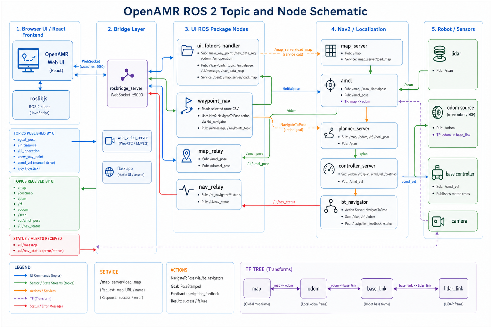
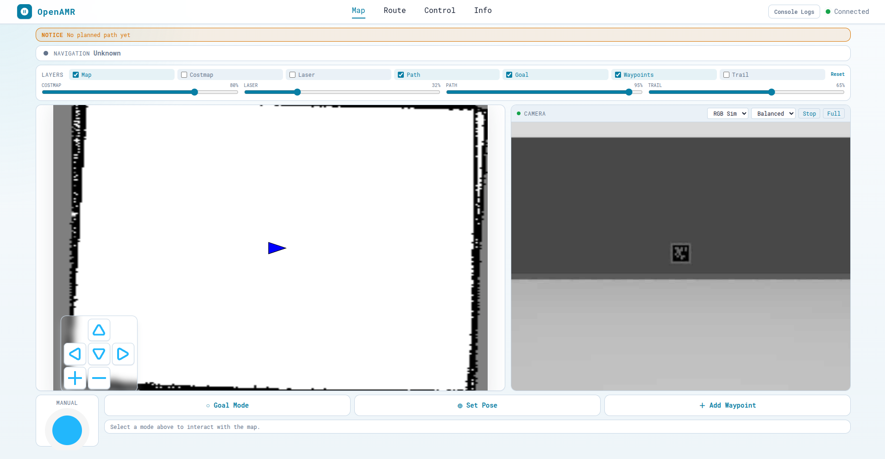
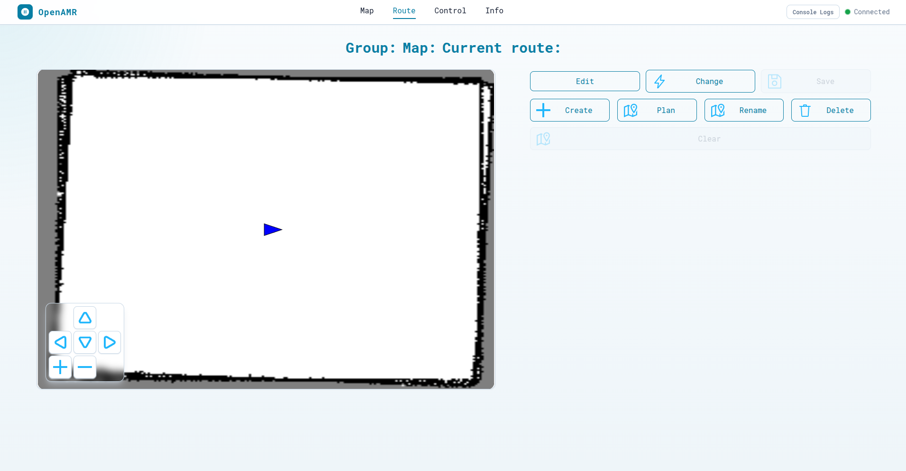
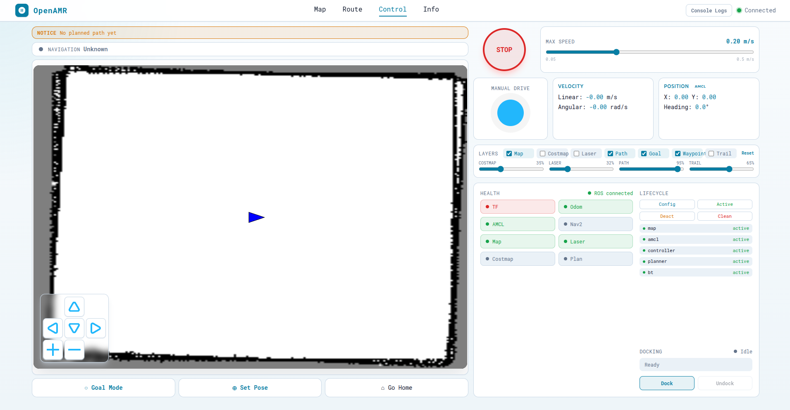
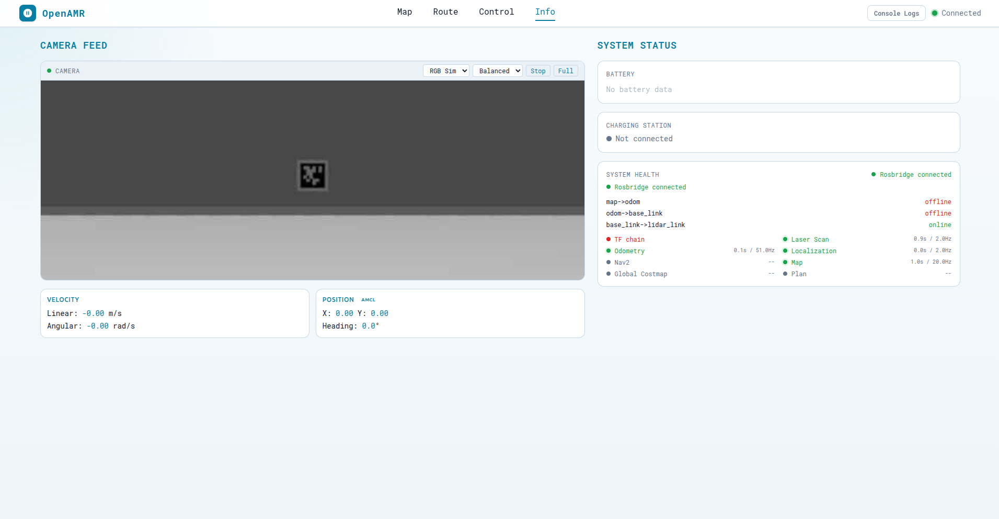

# OpenAMRobot UI

Standalone ROS 2 web UI workspace for OpenAMR autonomous mobile robots.

This repository contains the React browser dashboard, ROS 2 UI packages,
custom UI messages, and helper scripts needed to build and run the UI. It is
intended to live separately from the main robot or simulation workspace. The
robot stack should start Nav2, localization, docking, Gazebo/RViz, sensors, and
the map server. This workspace starts only the web UI, rosbridge, optional
camera web streaming, and lightweight topic relays used by the browser.

## Beginner Overview

There are two different workspaces involved when using the UI with a robot or
simulation:

| Workspace                                                       | What It Does                                                                                            |
| --------------------------------------------------------------- | ------------------------------------------------------------------------------------------------------- |
| Robot/simulation workspace, for example `~/openamr-platform-sw` | Starts the robot, Gazebo simulation, Nav2, localization, map server, docking, sensors, and robot topics |
| This UI workspace, `~/openamrobot-ui`                           | Starts the browser UI, rosbridge, optional camera web server, and small relay nodes                     |

Start the robot or simulation first. Then start the UI. The UI does not replace
Nav2, Gazebo, the map server, docking, or the robot bringup. It connects to
those running ROS topics and services.

Important words:

| Term        | Meaning                                                               |
| ----------- | --------------------------------------------------------------------- |
| ROS 2       | Robot middleware used to connect nodes, topics, services, and actions |
| Node        | A running ROS process, such as Flask, rosbridge, Nav2, or a relay     |
| Topic       | A named stream of messages, such as `/cmd_vel`, `/odom`, or `/map`    |
| Launch file | A Python file that starts multiple ROS nodes together                 |
| Gazebo      | The simulator that shows and runs the robot in a virtual world        |
| Headless    | Simulation runs without the Gazebo graphical window                   |
| Gazebo GUI  | The visible Gazebo window is opened                                   |
| RViz        | ROS visualization/debugging tool for maps, TF, costmaps, and Nav2     |
| rosbridge   | WebSocket bridge that lets the browser talk to ROS                    |
| Flask       | Python web server that serves the React UI                            |
| React       | JavaScript frontend used by the browser dashboard                     |

For most beginners, the safest order is:

1. Choose one installation method: Docker Compose or manual install.
2. Start the robot or simulation workspace.
3. Start the UI launch from this workspace.
4. Open the browser at `http://127.0.0.1:5050/control`.
5. Confirm the UI says ROS is connected before driving or sending goals.

## System Architecture

The UI is a browser-based ROS 2 dashboard. Flask serves the React app, the
browser talks to ROS through `rosbridge_server`, and `web_video_server` exposes
camera image topics as a browser-readable stream. The UI package provides small
relay/helper nodes for maps, AMCL pose, Nav2 status, waypoint routes, and
map/route file handling.

High-level data flow:

```text
Browser or touchscreen
        |
        v
React UI in web/
        |
        v
roslibjs over WebSocket
        |
        v
rosbridge_server
        |
        v
ROS 2 UI backend nodes in ros2/
        |
        v
Navigation, localization, docking, sensors, and robot systems
```



How to read the schematic:

- **Frontend, React app:** `web/src/index.js` starts the React app.
  `web/src/app/App.jsx` creates the ROS connection context and opens the
  `rosbridge_server` WebSocket. The page components then use that shared ROS
  connection to publish commands and subscribe to robot state.
- **Bridge and web services:** `rosbridge_server` is the main communication
  bridge between the browser and ROS 2. `rosapi` provides optional ROS graph
  helper services, and `web_video_server` exposes ROS image topics as MJPEG
  streams that the browser camera panels can display.
- **UI backend package:** `openamr_ui_package` contains the Python nodes owned
  by this workspace. `flask_app.py` serves the compiled React app. `map_relay.py`
  republishes `/map` as `/ui/map` with browser-friendly QoS. `nav_relays.py`
  republishes AMCL pose and selected Nav2/docking action statuses under `/ui/*`.
  `folders_handler.py` manages map, route, waypoint, and active-context file
  operations. `waypoint_nav.py` is an optional helper for following route CSVs
  through Nav2.
- **Workspace data:** `maps/` stores map YAML/PNG files, `paths/` stores route
  CSV files, and `param/current_map_route.yaml` stores the active map/route
  context used by the UI helper nodes.
- **Custom UI messages:** `openamr_ui_msgs` is a separate ROS 2 package for UI
  message definitions used by the backend helpers.
- **External robot or simulation stack:** Nav2, AMCL, `map_server`, docking,
  robot drivers, sensors, camera topics, battery/charger status, TF, odometry,
  and motor control are provided by the robot or simulation workspace. This UI
  connects to those topics and services; it does not own the robot stack.

## What This UI Provides

- Browser dashboard served by Flask on port `5050`
- ROS communication through `rosbridge_websocket` on port `9090`
- Camera/image streaming through `web_video_server` on port `8080` when that
  service is installed and running
- Map display through a `/map` to `/ui/map` QoS relay
- AMCL pose and navigation/docking status relays under `/ui/*`
- Manual robot control through `/cmd_vel`
- Goal pose, initial pose, route, map, waypoint, docking, and status controls
- Blockly visual robot programming at `/blocks` for building simple robot
  action programs without writing code
- Map and route file management when the optional UI helper nodes are running

## Repository Layout

```text
openamrobot-ui/
  Dockerfile                  # Container image for the UI workspace
  docker-compose.yml          # One-command Docker Compose launcher
  README.md
  scripts/
    build_frontend.sh          # Install web deps and build React
    sync_frontend_to_ros.sh    # Copy React build into ROS package static/app
    build_ros.sh               # Build ros2/ with colcon
    container_entrypoint.sh    # Container startup script
    run_ui_backend.sh          # Run the recommended UI launch
  web/
    package.json               # React scripts and dependencies
    public/ros/                # roslibjs, ros2d, nav2d browser libraries
    src/                       # React app source, including Blockly features
  ros2/
    src/openamr_ui_msgs/       # Custom UI messages
    src/openamr_ui_package/    # Main ROS 2 UI package
    src/openamr_ui_bringup/    # Small launch wrapper
```

Generated folders are intentionally ignored:

```text
web/node_modules/
web/build/
ros2/build/
ros2/install/
ros2/log/
```

## Documentation Layout

This top-level README is the source of truth for installing, building, running,
and troubleshooting the UI workspace. Folder-level README files are intentionally
short and only describe local package or directory details.

README index:

| README                                                                                                                                     | Use It For                                                                            |
| ------------------------------------------------------------------------------------------------------------------------------------------ | ------------------------------------------------------------------------------------- |
| [README.md](README.md)                                                                                                                     | Full workspace setup, launch, usage, and troubleshooting                              |
| [web/README.md](web/README.md)                                                                                                             | React frontend development notes                                                      |
| [web/src/features/blocks/README.md](web/src/features/blocks/README.md)                                                                     | Blockly setup, block reference, examples, execution, screenshots, and troubleshooting |
| [scripts/README.md](scripts/README.md)                                                                                                     | Helper script details                                                                 |
| [ros2/src/openamr_ui_package/README.md](ros2/src/openamr_ui_package/README.md)                                                             | ROS 2 UI package overview                                                             |
| [ros2/src/openamr_ui_package/launch/README.md](ros2/src/openamr_ui_package/launch/README.md)                                               | Launch file notes                                                                     |
| [ros2/src/openamr_ui_package/maps/README.md](ros2/src/openamr_ui_package/maps/README.md)                                                   | Map directory structure and usage                                                     |
| [ros2/src/openamr_ui_package/paths/README.md](ros2/src/openamr_ui_package/paths/README.md)                                                 | Route/path directory structure and usage                                              |
| [ros2/src/openamr_ui_package/param/README.md](ros2/src/openamr_ui_package/param/README.md)                                                 | Configuration details                                                                 |
| [ros2/src/openamr_ui_package/resource/README.md](ros2/src/openamr_ui_package/resource/README.md)                                           | ROS package resource marker notes                                                     |
| [ros2/src/openamr_ui_package/openamr_ui_package/README.md](ros2/src/openamr_ui_package/openamr_ui_package/README.md)                       | Python package modules and backend nodes                                              |
| [ros2/src/openamr_ui_package/openamr_ui_package/static/README.md](ros2/src/openamr_ui_package/openamr_ui_package/static/README.md)         | Static frontend asset directory notes                                                 |
| [ros2/src/openamr_ui_package/openamr_ui_package/templates/README.md](ros2/src/openamr_ui_package/openamr_ui_package/templates/README.md)   | Flask templates directory notes                                                       |
| [ros2/src/openamr_ui_package/openamr_ui_package/submodules/README.md](ros2/src/openamr_ui_package/openamr_ui_package/submodules/README.md) | Optional backend submodule notes                                                      |

Generated install copies under `install/` and build output folders are not
listed here. Edit the source README files above instead.

## Main Components

| Component                  | Purpose                                                                                 |
| -------------------------- | --------------------------------------------------------------------------------------- |
| `web/`                     | React frontend source for the browser UI                                                |
| `web/src/features/blocks/` | Blockly block definitions, toolbox categories, robot action executor, and Blockly guide |
| `openamr_ui_msgs`          | Custom message package used by the UI                                                   |
| `openamr_ui_package`       | Flask server, relays, map/route handlers, waypoint navigation helpers                   |
| `openamr_ui_bringup`       | Recommended UI-only launch wrapper                                                      |
| `scripts/`                 | Canonical build and sync commands                                                       |
| `Dockerfile`               | Builds the React app, syncs it into the ROS package, and builds the ROS 2 workspace     |
| `docker-compose.yml`       | Starts the compiled UI workspace with one Docker Compose command                        |

The compiled React app is copied into:

```text
ros2/src/openamr_ui_package/openamr_ui_package/static/app/
```

During `colcon build`, that static app is installed into the package share
directory and served by `openamr_ui_package.flask_app`.

## Installation Options

Choose one installation method. Docker Compose and manual installation are
alternatives, so do not run both UI instances at the same time on the same
ports.

| Method                        | Best For                                            | Main Command                |
| ----------------------------- | --------------------------------------------------- | --------------------------- |
| Option A: Docker Compose      | Beginners, clean machines, quick demos, WSL testing | `docker compose up --build` |
| Option B: Manual Install      | Developers, robot computers, ROS debugging          | Build frontend, sync, build |
| Robot or simulation workspace | Nav2, localization, docking, sensors, Gazebo/RViz   | Run separately              |

Both installation methods start only this UI workspace. The robot or simulation
stack must still run separately unless that stack is also containerized.

## Option A: Docker Compose Install

For Docker Compose, install only Docker Engine and the Docker Compose plugin.
The container installs the UI build dependencies inside the image.

Docker Compose is the easiest way to try the UI on a clean Linux or WSL
machine. It installs the required Ubuntu, Node.js, npm, ROS 2 Jazzy, rosbridge,
web video, Nav2 message, and Python packages inside a container, then builds
the frontend and ROS 2 workspace during the image build.

Check Docker first:

```bash
docker --version
docker compose version
```

Clone or place this repository at:

```bash
cd ~
git clone https://github.com/openAMRobot/openamrobot-ui.git openamrobot-ui
cd ~/openamrobot-ui
```

Start the UI workspace from the repository root:

```bash
docker compose up --build
```

Open the UI:

```text
http://127.0.0.1:5050/control
```

Open Blockly:

```text
http://127.0.0.1:5050/blocks
```

The Compose service uses `network_mode: host`. This is recommended on Linux and
WSL because ROS 2 discovery, rosbridge, and browser access work more reliably
when the container shares the host network. With host networking, the UI listens
on the normal ports:

| Service          | URL or Port             |
| ---------------- | ----------------------- |
| Flask web UI     | `http://127.0.0.1:5050` |
| ROSBridge        | `ws://127.0.0.1:9090`   |
| Web video server | `http://127.0.0.1:8080` |

Useful Docker Compose commands:

```bash
# Start and rebuild if Dockerfile or package dependencies changed
docker compose up --build

# Start in the background
docker compose up -d

# Show logs
docker compose logs -f

# Stop the UI container
docker compose down

# Rebuild frontend and ROS workspace again when the container starts
OPENAMR_REBUILD_ON_START=1 docker compose up
```

If you are using Docker Desktop without working host networking, replace
`network_mode: host` in `docker-compose.yml` with explicit port mappings:

```yaml
ports:
  - "5050:5050"
  - "9090:9090"
  - "8080:8080"
```

This can open the browser UI, but ROS 2 discovery between the container and an
external robot/simulation may still need extra Docker Desktop networking setup.
For real robot testing on Linux or WSL, keep host networking.

## Option B: Manual Install

Use manual installation when you want to develop the frontend, edit ROS
packages, debug `colcon` builds, or run directly on a robot computer.

Recommended environment:

- Ubuntu 24.04 with ROS 2 Jazzy
- Python 3
- `colcon`
- Node.js 18 or newer
- npm
- A running OpenAMR robot or simulation stack for full UI functionality

Before installing this UI workspace, ROS 2 Jazzy should already be installed and
sourceable:

```bash
source /opt/ros/jazzy/setup.bash
ros2 pkg prefix rclpy
```

Check Node.js before building the frontend:

```bash
node --version
npm --version
```

If `node --version` reports an older major version than 18, install a newer
Node.js from your preferred Node.js package source before running the frontend
build. Some Ubuntu `apt` sources may provide an older Node.js version.

Install common system dependencies:

```bash
sudo apt update
sudo apt install -y \
  python3-colcon-common-extensions \
  python3-rosdep \
  nodejs \
  npm \
  ros-jazzy-rosbridge-server \
  ros-jazzy-rosapi \
  ros-jazzy-web-video-server \
  ros-jazzy-nav2-msgs \
  ros-jazzy-nav2-simple-commander \
  python3-flask \
  python3-yaml \
  python3-serial
```

The ROS package also uses normal ROS interfaces such as `rclpy`, `std_msgs`,
`geometry_msgs`, `nav_msgs`, `action_msgs`, and Nav2-related packages available
from a complete ROS/Nav2 installation.

If `rosdep` is available, run it from the ROS workspace to install any missing
package dependencies declared by the ROS packages:

```bash
cd ~/openamrobot-ui/ros2
source /opt/ros/jazzy/setup.bash
rosdep update
rosdep install --from-paths src --ignore-src -r -y
```

If `rosdep` reports keys that cannot be resolved, install the matching ROS
Jazzy or Python packages manually, then rerun the build.

Clone or place this repository at:

```bash
cd ~
git clone https://github.com/openAMRobot/openamrobot-ui.git openamrobot-ui
cd ~/openamrobot-ui
```

Build the frontend:

```bash
bash scripts/build_frontend.sh
```

Sync the frontend build into the ROS package:

```bash
bash scripts/sync_frontend_to_ros.sh
```

Build the ROS 2 workspace:

```bash
cd ~/openamrobot-ui/ros2
source /opt/ros/jazzy/setup.bash
colcon build --symlink-install
source install/setup.bash
```

You can also use the helper script:

```bash
cd ~/openamrobot-ui
source /opt/ros/jazzy/setup.bash
bash scripts/build_ros.sh
source ros2/install/setup.bash
```

After the build finishes, confirm the UI packages are visible:

```bash
cd ~/openamrobot-ui/ros2
source /opt/ros/jazzy/setup.bash
source install/setup.bash
ros2 pkg list | grep openamr_ui
```

## Running the UI

Start the robot or simulation stack first in its own terminal. For example,
from the main OpenAMR platform workspace:

```bash
cd ~/openamr-platform-sw
source install/setup.bash
ros2 launch openamrobot_docking bringup_sim.launch.py
```

Then start this UI workspace in another terminal:

```bash
cd ~/openamrobot-ui/ros2
source /opt/ros/jazzy/setup.bash
source install/setup.bash
ros2 launch openamr_ui_bringup ui.launch.py
```

Open the UI:

```text
http://127.0.0.1:5050/control
```

If you are running on a robot or another computer, replace `127.0.0.1` with the
robot/computer IP address:

```text
http://<robot-ip>:5050/control
```

Full UI functionality requires the robot or simulation workspace to already be
publishing the expected ROS topics. This UI workspace starts the browser,
rosbridge, camera web server, and browser-friendly relays; it does not start the
full robot, Nav2, localization, map server, sensors, docking, or simulator.

After launching the UI, these commands are useful quick checks:

```bash
ros2 node list | grep -E "flask|rosbridge|web_video|map_relay|nav_relay"
ros2 topic list | grep -E "^/map$|^/ui/map$|^/odom$|^/tf$|^/tf_static$"
```

Expected UI-side nodes include `flask`, `rosbridge_websocket`,
`web_video_server`, `map_relay`, and `nav_relay`. Expected robot-side topics for
basic map and motion display include `/map`, `/odom`, `/tf`, and `/tf_static`.

## Blockly Robot Programming

The UI includes a Blockly page for building simple robot programs by dragging
blocks instead of writing code. Open it after the UI launch is running:

```text
http://127.0.0.1:5050/blocks
```

The Blockly page can build programs with actions such as:

```text
start robot program
  navigate to x 1.5 y 0 yaw 0
  wait until navigation complete timeout 60 seconds
  dock robot
```

Common Blockly categories include:

| Category    | Examples                                                                         |
| ----------- | -------------------------------------------------------------------------------- |
| Program     | start, repeat, log                                                               |
| Navigation  | navigate to coordinates, navigate to named location, wait for navigation, patrol |
| Motion      | wait, set speed, drive for time, rotate for time, stop movement, emergency stop  |
| Docking     | dock, undock                                                                     |
| Robot State | battery condition, set mode                                                      |

The Blockly editor supports browser Save/Load, JSON Import/Export, backend
saved programs, backend named locations, program templates, run history, and
plan validation. The `Run` button requires ROSBridge to be connected. Direct
motion blocks publish to `/cmd_vel`, navigation blocks publish goal poses, and
docking blocks publish the docking trigger topics.

For installation details, full block reference, examples, safety notes, and
troubleshooting, see:

```text
web/src/features/blocks/README.md
```

When changing Blockly code, rebuild and reinstall the frontend before testing
through Flask:

```bash
cd ~/openamrobot-ui
bash scripts/build_frontend.sh
bash scripts/sync_frontend_to_ros.sh
cd ros2
colcon build --packages-select openamr_ui_package
source install/setup.bash
```

Then restart the UI launch and hard refresh the browser with `Ctrl+Shift+R`.

## Simulation, Headless Mode, and Gazebo GUI

For normal UI testing, launch the platform simulation headlessly from the main
`openamr-platform-sw` workspace, then launch this UI workspace separately.
This keeps the UI independent from the platform workspace.

```bash
# Terminal 1: headless platform simulation
cd ~/openamr-platform-sw
source install/setup.bash
ros2 launch openamrobot_docking bringup_sim.launch.py gazebo_gui:=false use_rviz:=false
```

```bash
# Terminal 2: web UI
cd ~/openamrobot-ui/ros2
source /opt/ros/jazzy/setup.bash
source install/setup.bash
ros2 launch openamr_ui_bringup ui.launch.py
```

Then open:

```text
http://127.0.0.1:5050/control
```

This starts the recommended independent UI mode:

```text
Gazebo GUI: off
RViz: off
UI: on, from the separate openamrobot-ui workspace
```

Use Gazebo GUI mode only when you need to inspect the world, physics,
collisions, sensor placement, or robot movement visually. In that case, run the
simulation and UI separately:

```bash
# Terminal 1: platform simulation with Gazebo GUI/RViz
cd ~/openamr-platform-sw
source install/setup.bash
ros2 launch openamrobot_docking bringup_sim.launch.py
```

```bash
# Terminal 2: web UI
cd ~/openamrobot-ui/ros2
source /opt/ros/jazzy/setup.bash
source install/setup.bash
ros2 launch openamr_ui_bringup ui.launch.py
```

The old `headless:=true` / `headless:=false` arguments and the former
`use_ui:=true` platform shortcut are not used by the current independent UI
setup.

## Launch Options

Recommended UI-only launch:

```bash
ros2 launch openamr_ui_bringup ui.launch.py
```

Direct package launch for the web services and relays:

```bash
ros2 launch openamr_ui_package new_ui_launch.py
```

Helper script equivalent:

```bash
bash scripts/run_ui_backend.sh
```

The UI launch mainly starts web, bridge, camera, and relay nodes. The robot or
simulation workspace owns Nav2, localization, and the map server, so configure
simulation time there when needed.

Route and map file-management features need the optional helper launch:

```bash
ros2 launch openamr_ui_package physnode_launch.py
```

Run this only when you need UI actions that create, rename, delete, save, or
load map and route files, or when you need the route-following helper. The
normal dashboard, map display, manual driving, camera, and status panels use the
recommended `openamr_ui_bringup ui.launch.py` launch.

## Ports and URLs

Defaults are configured in:

```text
ros2/src/openamr_ui_package/param/config.yaml
```

| Service          | Default                 | Used For                 |
| ---------------- | ----------------------- | ------------------------ |
| Flask app        | `http://127.0.0.1:5050` | Serves the React UI      |
| Rosbridge        | `ws://127.0.0.1:9090`   | Browser to ROS WebSocket |
| Web video server | `http://127.0.0.1:8080` | Camera/image streams     |

For access from another computer, tablet, or touchscreen on the same WiFi, make
sure the browser device can reach the robot or UI computer on these ports:

| Port   | Protocol  | Must Be Reachable For                                |
| ------ | --------- | ---------------------------------------------------- |
| `5050` | HTTP      | Opening the web UI                                   |
| `9090` | WebSocket | ROS status, topics, commands, map, and robot control |
| `8080` | HTTP      | Camera/image streaming                               |

The WiFi/router must allow devices to talk to each other. Guest networks,
client isolation, AP isolation, VPN routing, and local firewalls can block the
UI even when both devices are connected to the same network.

For access from another computer, tablet, or touchscreen on the same WiFi, make
sure the browser device can reach the robot or UI computer on these ports:

| Port   | Protocol  | Must Be Reachable For                                |
| ------ | --------- | ---------------------------------------------------- |
| `5050` | HTTP      | Opening the web UI                                   |
| `9090` | WebSocket | ROS status, topics, commands, map, and robot control |
| `8080` | HTTP      | Camera/image streaming                               |

The WiFi/router must allow devices to talk to each other. Guest networks,
client isolation, AP isolation, VPN routing, and local firewalls can block the
UI even when both devices are connected to the same network.

The React development server runs on:

```text
http://localhost:3000
```

When running through Flask, the frontend connects to rosbridge using the page
hostname. When running through `localhost:3000`, it falls back to
`ROSBRIDGE_SERVER_IP` in:

```text
web/src/shared/constants/index.js
```

Update that IP if your robot is not at the default `192.168.0.100`.

For reliable robot use across reboots or WiFi changes, reserve a stable IP for
the robot or UI computer in the router DHCP settings, or update the dev-server
fallback IP before running `npm run dev`.

## Using the Web UI

The app has these main routes:

| Page    | URL        | Purpose                                        |
| ------- | ---------- | ---------------------------------------------- |
| Map     | `/`        | Map view, robot pose, goals, map layers        |
| Route   | `/route`   | Route and waypoint management                  |
| Control | `/control` | Manual driving, docking, robot control, status |
| Blocks  | `/blocks`  | Blockly visual robot programming               |
| Info    | `/info`    | System/topic information                       |

### Page Screenshots and Descriptions

#### Map Page



The Map page is the main situational-awareness page. Use it when you want to
see where the robot is, inspect the current map, send a navigation goal, set the
initial localization pose, build a temporary waypoint queue, or watch the camera
feed beside the map.

The central map panel displays the occupancy grid received from `/ui/map`. Free
space, walls, and unknown areas are rendered from the map data published by the
robot or simulation stack and relayed by `map_relay`. The blue robot marker
shows the current robot pose from odometry, TF, and AMCL-related updates. When
navigation data is available, the page can also show the planned path, route
waypoints, goal marker, laser scan, global costmap, local costmap, and trail.

The layer controls let you turn map overlays on or off without restarting ROS.
This is useful when debugging navigation: keep the map and robot visible for
normal operation, then enable costmap, laser, path, goal, waypoint, or trail
layers when you need more detail. The sliders control overlay opacity so dense
debug overlays do not hide the map.

The map interaction buttons control the way clicks on the map are interpreted.
`Goal Mode` publishes a navigation goal to `/goal_pose`; click the map and drag
before releasing to set the goal heading. `Set Pose` publishes an initial pose
to `/initialpose`, which is useful after localization is reset or the robot pose
is wrong. `Add Waypoint` builds a temporary queue on the Map page; `Execute
Queue` sends each queued waypoint as a `/goal_pose` goal and advances when the
Nav2 status reports success. The zoom and pan buttons in the map corner are
local browser controls, so they help you inspect the map even if the robot is
not moving.

The camera panel uses `web_video_server` on port `8080`. It can show the live
robot or simulation camera stream, select the configured image topic, adjust the
stream mode, stop/start the stream, and open the camera in a larger view. If the
camera area is blank, verify that `web_video_server` is running and that the
selected image topic exists.

#### Route Page



The Route page is used to create, select, edit, and manage reusable waypoint
routes for the current map. It prepares named route files for route workflows
and helper nodes instead of sending a one-time goal from the Map page.

The map area shows the same operating environment as the Map page, but the
controls are focused on route editing. A route is a saved list of waypoint
poses. Each waypoint stores position and heading, so the robot can approach the
point in the intended orientation. Route data is stored under
`ros2/src/openamr_ui_package/paths/` and is exchanged with the helper nodes
through topics such as `/nav_data_req`, `/nav_data_resp`, `/ui_operation`,
`/new_way_point`, `/WP_req`, and `/WayPoints_topic`.

`Create` starts a new route. While creating or editing, place waypoints on the
map to define the path. `Edit` loads the current route for changes, and pressing
it again cancels edit mode. `Change` opens the route selector for the current
map. `Plan` asks Nav2's `/compute_path_to_pose` service for a path from the
current robot pose to a clicked goal, downsamples that path, and publishes the
resulting points to `/new_way_point`. `Save` writes the route so it can be
selected again later. `Rename` changes the route name, `Delete` removes a route,
and `Clear` removes the currently displayed route points from the editor so you
can start the shape again.

The route header shows the current group, map, and route context when that data
is available. This matters because routes belong to maps: a route drawn for one
map may not be valid on a different floor, building, or simulation world. Keep
the active map and route aligned before saving or using the saved waypoints with
the helper nodes.

Route file operations require the optional helper nodes from
`openamr_ui_package/launch/physnode_launch.py`. If route buttons do not update
anything, confirm that the handler node is running and that messages are moving
on `/nav_data_req`, `/nav_data_resp`, `/ui_operation`, and `/ui_message`.

#### Control Page



The Control page is the operator page for driving and supervising the robot. It
combines the map, manual drive controls, navigation state, safety stop, speed
limit, robot telemetry, layer toggles, lifecycle controls, health checks, and
docking controls in one screen. Unlike the Map and Info pages, it does not show
the camera feed; it prioritizes drive and status controls.

Manual driving publishes velocity commands on `/cmd_vel`. The joystick controls
linear and angular motion, while the max-speed slider limits the command range
used by the UI. The large `STOP` button immediately sends zero velocity and
cancels the active Nav2 goal through the navigation cancel action. Use it when
manual control or an active goal should stop right away.

The embedded map remains useful while operating. `Goal Mode` can send a goal
pose, `Set Pose` can correct the initial localization estimate, and `Go Home`
sends the robot back toward the default home pose. The navigation status banner
and path notice help show whether Nav2 has an active goal, a planned path, or an
unknown/idle state.

The velocity and position panels summarize live robot feedback. Velocity comes
from odometry, while position is shown from the UI's AMCL/pose tracking. These
numbers are helpful when confirming whether commands are actually reaching the
robot and whether localization is stable.

The health and lifecycle panels are quick diagnostics. Health indicators show
whether important streams such as TF, odometry, AMCL, map, laser, costmap, and
plan data are online. Lifecycle controls can configure, activate, deactivate,
clean up, or inspect lifecycle-managed navigation nodes when those services are
available. If a lifecycle row is offline or unknown, check that the matching
Nav2 node is running in the robot or simulation workspace.

The docking area publishes dock and undock trigger messages and reports status
from `/dock_trigger_status`. After an undock finishes, the UI can also publish a
standby goal on `/goal_pose`. Docking depends on the robot stack providing the
docking behavior; the UI only exposes the controls and status.

#### Blocks Page


The Blocks page is the visual robot-programming page. It lets beginners build a
robot program by dragging Blockly blocks instead of writing JavaScript or ROS
code. The left toolbox groups blocks into `Program`, `Navigation`, `Motion`,
`Docking`, and `Robot State`. The center workspace is where the blocks are
assembled. The right panel shows ROSBridge connection status, Run/Stop buttons,
program templates, run history, backend saved programs, named locations, plan
checks, and the Generated Plan created from the connected blocks.

The top toolbar contains local program controls. `Save` and `Load` use browser
storage, `Import` and `Export` move Blockly programs as JSON files, and `Reset`
clears the workspace back to the starter program.


A Blockly program should start with `start robot program`. Robot actions must be
connected below that start block to run. Loose blocks can remain on the
workspace while you are experimenting, but they are not part of the generated
robot plan unless they are connected under the start block that the planner
reads. For real robot tests, keep one start block in the workspace to avoid
confusion.

Navigation blocks publish goal poses, motion blocks publish direct velocity
commands such as `/cmd_vel`, docking blocks publish dock or undock triggers, and
state blocks can use battery data or publish mode commands. Always check the
Generated Plan before pressing `Run`; it is the best quick preview of what will
be sent to the robot.

The Plan Checks panel reports safety and validation warnings before execution.
The Generated Plan panel shows the exact step list built from connected blocks.


For the full Blockly setup guide, block reference, examples, troubleshooting,
and safety notes, see:

```text
web/src/features/blocks/README.md
```

#### Info Page



The Info page is the status and diagnostics page. Use it when you want a calm
overview of camera, battery, charging, robot movement, localization, rosbridge,
TF, and core navigation signals without the extra control surface of the Control
page.

The camera feed mirrors the camera component used elsewhere in the UI. It lets
you confirm that image streaming works independently from map rendering or
manual driving. This is useful when checking whether a blank camera view is a UI
issue, a `web_video_server` issue, or a missing ROS image topic.

The battery panel subscribes to `/battery_status` and displays the battery
percentage when data is available. The charging-station panel subscribes to
`/charge_station_connected` and shows whether the robot is connected to the
charger. If no battery data appears, the UI can still run; it simply means no
node is publishing the battery topic. The standard UI launch does not start
`battery.py`.

The velocity and position panels provide a lightweight telemetry summary. They
show whether the UI is receiving robot motion and pose information, which helps
separate frontend connection problems from navigation problems. If velocity
updates but pose is stale, inspect localization and TF. If neither updates,
check rosbridge, odometry, and the robot/simulation bringup.

The system-health panel is the fastest place to inspect ROS connectivity from
the browser. It reports rosbridge connection state, selected TF links such as
`map->odom`, `odom->base_link`, and `base_link->lidar_link`, plus key streams
such as laser scan, localization, map, global costmap, plan, and Nav2. Online
items show the UI is receiving recent messages; offline items point to missing
publishers, stopped nodes, or topic-name mismatches.

Typical operating flow:

1. Start the robot or simulation stack.
2. Start the UI launch from this repository.
3. Open `/control` or `/`.
4. Confirm the ROS connection indicator shows connected.
5. Use manual control, map goal setting, route management, docking controls, and
   status panels as needed.
6. Use the route page to create, edit, save, rename, delete, and select routes
   when the optional helper nodes from `physnode_launch.py` are running.
7. Use map controls only when the Nav2 map server is available.

Hard-refresh the browser after rebuilding frontend assets:

```text
Ctrl+Shift+R
```

## Important ROS Topics

Most shared frontend topic names are defined in:

```text
web/src/shared/constants/index.js
```

Some route-editor and docking topics are defined directly in the page or
component that uses them.

Common topics:

| Topic                         | Direction       | Purpose                                                       |
| ----------------------------- | --------------- | ------------------------------------------------------------- |
| `/cmd_vel`                    | UI publishes    | Manual velocity commands                                      |
| `/odom`                       | UI subscribes   | Robot pose and velocity                                       |
| `/ui/map`                     | UI subscribes   | Browser-friendly occupancy grid relay                         |
| `/global_costmap/costmap`     | UI subscribes   | Global costmap layer                                          |
| `/local_costmap/costmap`      | UI subscribes   | Local costmap layer                                           |
| `/scan_filtered`              | UI subscribes   | Laser scan layer                                              |
| `/plan`                       | UI subscribes   | Planned path                                                  |
| `/tf`, `/tf_static`           | UI subscribes   | Robot/map transforms                                          |
| `/ui/amcl_pose`               | UI subscribes   | Relayed AMCL pose                                             |
| `/ui/navigate_to_pose/status` | UI subscribes   | Relayed Nav2 goal status                                      |
| `/goal_pose`                  | UI publishes    | Navigation goal                                               |
| `/initialpose`                | UI publishes    | Initial localization pose                                     |
| `/ui_operation`               | UI publishes    | Map/route/navigation commands                                 |
| `/ui_message`                 | UI subscribes   | Messages from UI helper nodes                                 |
| `/nav_data_req`               | UI publishes    | Request map/group/route file data                             |
| `/nav_data_resp`              | UI subscribes   | Map/group/route file data response                            |
| `/new_way_point`              | UI publishes    | Route waypoint pose added from the route editor               |
| `/WP_req`                     | UI publishes    | Request waypoint data                                         |
| `/WayPoints_topic`            | UI subscribes   | Route waypoint array                                          |
| `/dock_trigger`               | UI publishes    | Docking request trigger                                       |
| `/undock_robot`               | UI publishes    | Undocking request trigger                                     |
| `/dock_trigger_status`        | UI subscribes   | Docking state string                                          |
| `/ui/dock_robot/status`       | Relay publishes | Relayed dock action status for browser-compatible consumers   |
| `/ui/undock_robot/status`     | Relay publishes | Relayed undock action status for browser-compatible consumers |
| `/battery_status`             | UI subscribes   | Battery status                                                |
| `/charge_station_connected`   | UI subscribes   | Charger connection status                                     |

## What the UI Launch Starts

`openamr_ui_package/launch/new_ui_launch.py` starts:

| Node                                   | Purpose                                      |
| -------------------------------------- | -------------------------------------------- |
| `openamr_ui_package/flask`             | Serves the React build                       |
| `rosbridge_server/rosbridge_websocket` | WebSocket bridge for roslibjs                |
| `rosapi/rosapi_node`                   | Optional ROS graph helper services           |
| `web_video_server/web_video_server`    | Optional browser camera streaming            |
| `openamr_ui_package/map_relay`         | Relays `/map` to `/ui/map`                   |
| `openamr_ui_package/nav_relay`         | Relays AMCL/navigation/docking status topics |

Additional helper nodes are available in `openamr_ui_package/launch/physnode_launch.py`
if map/route file operations or waypoint route-following helpers are needed:

| Node                         | Purpose                                            |
| ---------------------------- | -------------------------------------------------- |
| `openamr_ui_package/handler` | Map, group, route, and waypoint file operations    |
| `openamr_ui_package/nav`     | Route-following helper using Nav2 `BasicNavigator` |

## Frontend Development

Run the React dev server:

```bash
cd ~/openamrobot-ui/web
npm install
npm run dev
```

Open:

```text
http://localhost:3000
```

The frontend can render without ROS, but live robot data and controls require
rosbridge to be running and reachable.

Build production assets:

```bash
cd ~/openamrobot-ui
bash scripts/build_frontend.sh
bash scripts/sync_frontend_to_ros.sh
```

Rebuild the ROS package after syncing:

```bash
cd ~/openamrobot-ui/ros2
source /opt/ros/jazzy/setup.bash
colcon build --symlink-install --packages-select openamr_ui_package
source install/setup.bash
```

Run frontend linting:

```bash
cd ~/openamrobot-ui/web
npm run lint
```

Run frontend tests:

```bash
cd ~/openamrobot-ui/web
npm test
```

## ROS Development

Build all ROS packages:

```bash
cd ~/openamrobot-ui/ros2
source /opt/ros/jazzy/setup.bash
colcon build --symlink-install
source install/setup.bash
```

Build selected packages:

```bash
colcon build --symlink-install --packages-select openamr_ui_msgs openamr_ui_package openamr_ui_bringup
```

Run package tests:

```bash
colcon test --packages-select openamr_ui_package openamr_ui_msgs
colcon test-result --verbose
```

After changing message definitions in `openamr_ui_msgs`, rebuild and source the
workspace again before running any nodes:

```bash
colcon build --symlink-install --packages-select openamr_ui_msgs openamr_ui_package
source install/setup.bash
```

## Map and Route Files

Maps are stored under:

```text
ros2/src/openamr_ui_package/maps/
```

Routes are stored under:

```text
ros2/src/openamr_ui_package/paths/
```

The active map and route are tracked in:

```text
ros2/src/openamr_ui_package/param/current_map_route.yaml
```

Route CSV files contain waypoint pose data used by the route UI and waypoint
navigation helper. The UI helper node can create groups, save routes, edit
routes, rename routes/maps/groups, delete routes/maps/groups, and request the
current waypoint list.

## Normal Development Workflow

For frontend changes:

```bash
cd ~/openamrobot-ui
bash scripts/build_frontend.sh
bash scripts/sync_frontend_to_ros.sh

cd ~/openamrobot-ui/ros2
source /opt/ros/jazzy/setup.bash
colcon build --symlink-install --packages-select openamr_ui_package
source install/setup.bash
ros2 launch openamr_ui_bringup ui.launch.py
```

For Python or launch file changes:

```bash
cd ~/openamrobot-ui/ros2
source /opt/ros/jazzy/setup.bash
colcon build --symlink-install
source install/setup.bash
ros2 launch openamr_ui_bringup ui.launch.py
```

For message changes:

```bash
cd ~/openamrobot-ui/ros2
source /opt/ros/jazzy/setup.bash
colcon build --symlink-install --packages-select openamr_ui_msgs openamr_ui_package
source install/setup.bash
```

## Troubleshooting

If the page opens but ROS status is disconnected:

- Confirm `rosbridge_websocket` is running.
- Confirm port `9090` is reachable from the browser machine.
- If using the React dev server, update `ROSBRIDGE_SERVER_IP` in
  `web/src/shared/constants/index.js`.
- Check browser console WebSocket errors.

If the page does not open:

- Confirm the UI launch is still running.
- Confirm Flask is listening on port `5050`.
- Check `ros2/src/openamr_ui_package/param/config.yaml` for the configured host
  and port.

If the map is blank:

- Confirm the robot/simulation stack is publishing `/map`.
- Confirm `map_relay` is running.
- Check that the frontend is subscribed to `/ui/map`.
- Confirm the map server belongs to the main robot/Nav2 stack.

If camera is missing:

- Install `ros-jazzy-web-video-server`.
- Confirm `web_video_server` is running on port `8080`.
- Confirm the camera/image topic exists in ROS.

If UI changes do not appear:

- Rebuild the frontend.
- Sync `web/build` into the ROS package.
- Rebuild the ROS package.
- Hard-refresh the browser with `Ctrl+Shift+R`.

If `colcon` cannot find packages:

- Source ROS first with `source /opt/ros/jazzy/setup.bash`.
- Run commands from `~/openamrobot-ui/ros2`.
- Rebuild and source `install/setup.bash`.

## Notes

- Do not run a second standalone map server from this UI workspace when the
  main Nav2 stack already owns `/map_server`.
- `map_server_launch.py` is a deprecated compatibility launch and is namespaced
  under `ui_legacy` to avoid conflicting with the platform map server.
- Keep heavy UI layers such as camera, laser, and costmaps off unless needed for
  debugging, especially when simulation performance is tight.
- The UI is most useful when the robot or simulation stack is already healthy;
  use RViz and ROS CLI tools for deep Nav2, TF, or costmap debugging.
