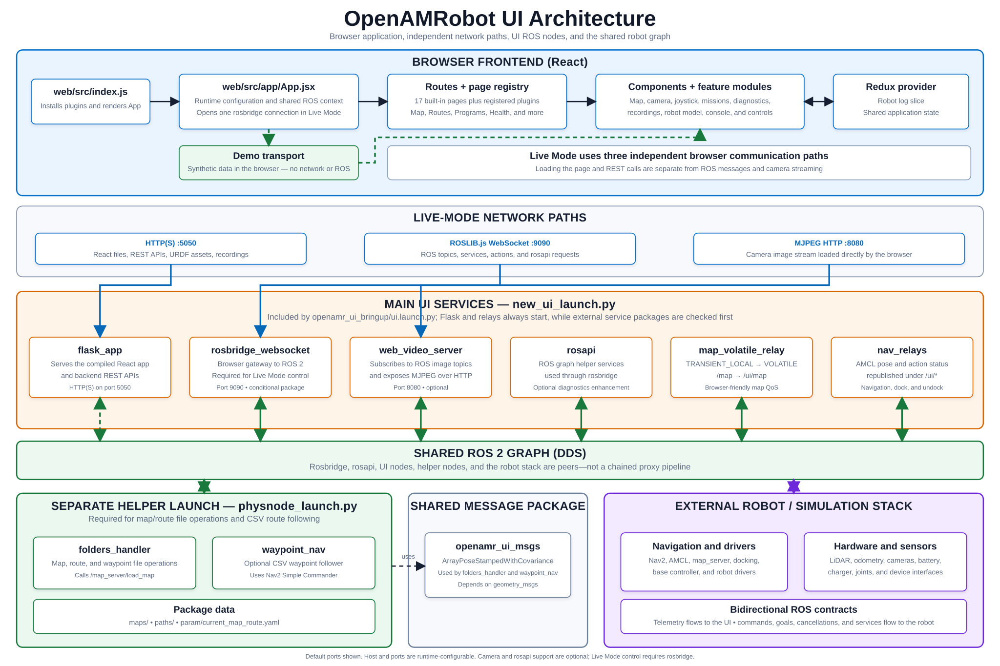

<div align="left">

# OpenAMRobot UI

**Browser dashboard for ROS 2 mobile robots.**

Mapping, manual driving, Nav2 goals, camera views, saved routes, visual programs,
missions, health diagnostics and recordings in one interface. No ROS tooling on the client.

[](https://github.com/openAMRobot/openamrobot-ui/actions/workflows/ci.yml)
[](LICENSE)
[](web/package.json)
[](docs/installation.md)

<a href="https://youtu.be/orwzcDPvAEs" target="_blank" rel="noopener noreferrer">
  
</a>

**<a href="https://youtu.be/orwzcDPvAEs" target="_blank" rel="noopener noreferrer">▶ Watch the feature tour, with narration</a>**

[Quick start](#quick-start) · [Lessons](docs/lessons/README.md) · [Installation](docs/installation.md) · [Full platform release](https://github.com/openAMRobot/openamrobot-release/releases/latest)

</div>

---

**No robot? No problem.** Demo Mode runs the entire interface on browser-side sample
data, so you can explore every page without a robot or a ROS connection.

```bash
git clone https://github.com/openAMRobot/openamrobot-ui.git
cd openamrobot-ui
docker compose up --build
# open http://127.0.0.1:5050 and choose "Explore without a robot"
```

|  |  |
| --- | --- |
| 🗺️ **Map and drive** | Live map, robot pose, click-to-goal, joystick, docking, waypoints |
| 🧭 **Routes and missions** | Reusable waypoint sequences, schedules, multi-step missions |
| 🧩 **Visual programs** | Blockly blocks plus Voice Command backed by an Anthropic key |
| 📷 **See everything** | Camera streams, telemetry, battery, URDF model, live joint state |
| 🩺 **Health and history** | Topic freshness, lifecycle, diagnostics, metrics, events, rosbag replay |
| 🔌 **Extendable** | Add a panel, a device or a Blockly block. MIT licensed |

## Contents

- [Quick start](#quick-start)
- [Requirements](#requirements)
- [Installation](#installation)
- [Main pages](#main-pages)
- [Architecture](#architecture)
- [Security and access](#security-and-access)
- [Data and backups](#data-and-backups)
- [Documentation](#documentation)
- [Development](#development)
- [Troubleshooting](#troubleshooting)
- [Project](#project)
  - [Support the project](#support-the-project)
  - [Third-party notices](#third-party-notices)

## Quick start

Requirements: Docker Engine and the Docker Compose plugin.

```bash
git clone https://github.com/openAMRobot/openamrobot-ui.git
cd openamrobot-ui
docker compose up --build
```

Then:

1. Open `http://127.0.0.1:5050/`.
2. Choose **Explore without a robot** in the first-run guide (or open
   `/config` and enable **Demo Mode** if the guide doesn't appear).
3. Confirm the purple Demo Mode banner and the green connection indicator.
4. Follow [Lesson 00 — Your First 10 Minutes](docs/lessons/00-your-first-10-minutes.md).

That's the fastest path to a running UI. For every Docker flag, the manual
(non-Docker) install, and what a healthy startup looks like, see
[Installation](#installation) below.

### Connecting to a real robot or simulation

The robot stack and the UI are separate workspaces — start the robot or
simulation first, then launch the UI against it:

```text
Robot/simulation workspace → Nav2, localization, sensors, drivers, simulator
UI workspace               → dashboard, rosbridge, camera server, relays
```

```bash
cd ~/openamrobot-ui/ros2
source /opt/ros/jazzy/setup.bash
source install/setup.bash
ros2 launch openamr_ui_bringup ui.launch.py
```

Before enabling motion:

> [!CAUTION]
> The red **E-STOP** in the dashboard is a *software* stop: it sends one
> zero-velocity command and asks Nav2 to cancel the active goal. It is not
> latched, not safety-rated, and not independent of the browser, network,
> rosbridge, or robot controller. Keep a tested physical emergency stop
> within reach whenever you operate real hardware.

1. Turn Demo Mode off.
2. Confirm the correct robot connection profile.
3. Check that the connection indicator is green.
4. Open **Health** and confirm the required topics are fresh.
5. Confirm the displayed map and robot pose match the physical robot.
6. Use conservative speed limits and clear the operating area.
7. Test the physical emergency stop.

## Requirements

| Use case | Required |
| --- | --- |
| Docker demo/deployment | Docker Engine and Docker Compose; Linux or WSL is recommended for host networking |
| Manual installation | Ubuntu 24.04, ROS 2 Jazzy, Python 3, `colcon`, Node.js, and npm (see [Compatibility](#compatibility) for the supported Node range) |
| Live operation | A separately running OpenAMR robot or simulation stack |
| Remote browser access | TCP ports `5050`, `9090`, and optionally `8080` reachable |
| Voice Command | An Anthropic API key supplied to the backend at runtime |

### Compatibility

| Component | Current target | Status |
| --- | --- | --- |
| Ubuntu | 24.04 LTS | Manual-install target |
| ROS 2 | Jazzy | Required by the documented packages and commands |
| Node.js | 18–20 | Enforced by `web/package.json` `engines` (`>=18 <21`); CI validates on Node 20 |
| `openamr-platform-sw` | `main` branch | Pin it to a commit you've validated against this UI version — treat that pin as part of your deployment configuration, not a fixed release |
| Robot hardware | Topic-compatible OpenAMRobot platform | Hardware revision is not yet pinned; validate drivers, limits, docking, and E-stop behavior per robot |

For complete installation details, Docker Desktop networking, simulation
commands, and dependency explanations, see the
[installation and launch guide](docs/installation.md).

## Installation

Choose Docker or manual installation — don't run both on the same ports.

### Docker Compose

```bash
docker compose up --build   # build and run in the foreground
docker compose up -d        # ...or run in the background
docker compose logs -f      # follow logs
docker compose down         # stop (saved backend data is kept)
```

To enable Voice Command, pass the key at runtime rather than baking it into
the image:

```bash
ANTHROPIC_API_KEY="your-key" docker compose up
```

Real `.env` files are excluded from Docker images.

**Success check:** the dashboard opens on port `5050`, and the logs show
`flask_app`, `rosbridge_websocket`, `map_volatile_relay`, and `nav_relays`.
The optional camera node appears only when `web_video_server` is installed.

### Manual install

Install ROS 2 Jazzy, Node.js, npm, and the declared ROS dependencies
(including Xacro, needed for the Robot Description page). Then:

```bash
cd ~/openamrobot-ui
bash scripts/build_frontend.sh
bash scripts/sync_frontend_to_ros.sh

cd ros2
source /opt/ros/jazzy/setup.bash
colcon build --symlink-install
source install/setup.bash
ros2 launch openamr_ui_bringup ui.launch.py
```

The full dependency command and `rosdep` workflow are in the
[manual installation guide](docs/installation.md#manual-installation).

**Success check:**

```bash
ros2 pkg list | grep openamr_ui
```

This should list `openamr_ui_bringup`, `openamr_ui_msgs`, and
`openamr_ui_package`.

## Main pages

| Page | URL | Use it for |
| --- | --- | --- |
| Map | `/` | Map, goals, pose, joystick, docking, and waypoints |
| Routes | `/route` | Reusable waypoint sequences |
| Maps | `/maps` | Create, save, switch, rename, and organize maps |
| Programs | `/blocks` | Blockly visual programs and Voice Command |
| Scheduler | `/scheduler` | Time-triggered browser-side actions |
| Missions | `/missions` | Multi-step browser-side missions |
| Status | `/info` | Camera, telemetry, battery, and system health |
| Robot | `/robot` | URDF/Xacro model and live joint information |
| Devices | `/devices` | External-device registry and serial detection |
| Health | `/health` | Readiness, topic freshness, lifecycle, and diagnostics |
| Metrics | `/metrics` | Distance, uptime, and success statistics |
| Recordings | `/recordings` | Rosbag recording and replay |
| Events | `/events` | Filterable event history |
| Console | `/console` | `/rosout` and topic echo |
| Parameters | `/params` | Read or change Nav2 parameters |
| Fleet | `/fleet` | Robot profiles and active-robot selection |
| Config | `/config` | Connections, Demo Mode, limits, and preferences |
| Notes | `/notes` | Example plugin page |

Scheduler and Missions run in the browser tab — keep the tab open for
scheduled actions, and don't assume an interrupted browser session resumes
safely.

See [Lesson 06](docs/lessons/06-the-pages.md) for screenshots, dependencies,
and task-based page guidance.

## Architecture



| Service | Default | Purpose |
| --- | --- | --- |
| Flask UI | `http://127.0.0.1:5050` | Serves the React dashboard and REST API |
| Rosbridge | `ws://127.0.0.1:9090` | Browser-to-ROS communication |
| Web video | `http://127.0.0.1:8080` | Optional camera streams |

Map/route file operations and route-following helpers also require:

```bash
ros2 launch openamr_ui_package physnode_launch.py
```

For the communication and topic model, read
[Lesson 03](docs/lessons/03-how-the-browser-talks-to-ros.md),
[Lesson 04](docs/lessons/04-data-flow-and-relays.md), and
[Lesson 10](docs/lessons/10-topics-as-the-contract.md).

## Security and access

Only unauthenticated `AUTH_MODE=open` is implemented today. Anyone who can
reach the configured UI and rosbridge ports can potentially view data and
command the robot.

- Keep the dashboard on a trusted local network.
- Don't expose ports `5050`, `9090`, or `8080` directly to the internet.
- Use firewall rules or an authenticated reverse proxy when network isolation
  isn't enough on its own.
- Don't commit `.env` files or API keys.
- Read [SECURITY.md](SECURITY.md) before deploying outside a private lab
  network, or to report a vulnerability.

`local` and `external` are reserved for future authentication modes.
Requesting either currently falls back to `open` and shows a warning.

## Data and backups

| Data | Location |
| --- | --- |
| Backend programs, locations, history, recordings, and certificates | `~/.openamr_ui/` |
| Docker backend data | Named `openamr_ui_data` volume |
| Schedules, missions, devices, profiles, metrics, and preferences | Current browser profile's `localStorage` |
| Maps and routes | `ros2/src/openamr_ui_package/maps/` and `paths/` |

Browser-local data doesn't automatically move to another browser or computer.
Back it up before reinstalling, clearing browser storage, or removing Docker
volumes.

## Documentation

| Start here | Purpose |
| --- | --- |
| [Lesson 00](docs/lessons/00-your-first-10-minutes.md) | Safe first session and Demo Mode |
| [Lessons 00–13](docs/lessons/README.md) | Operator and architecture learning paths |
| [Glossary](docs/lessons/glossary.md) | ROS/UI term lookup |
| [Extension guides](docs/extending/README.md) | Add a panel, device, or Blockly block |
| [Installation guide](docs/installation.md) | Docker, manual installation, networking, and launch options |
| [Development guide](docs/development.md) | Frontend and ROS workflows, tests, and generated files |
| [Troubleshooting guide](docs/troubleshooting.md) | Symptom-based checks and ROS commands |
| [Frontend guide](web/README.md) | React development |
| [Blockly guide](web/src/features/blocks/README.md) | Blocks, execution, Voice Command, and troubleshooting |
| [Contributing](CONTRIBUTING.md) | Development and pull-request expectations |
| [Security](SECURITY.md) | Private vulnerability reporting and deployment guidance |

## Development

Frontend:

```bash
cd web
npm ci
npm run dev
```

Production build:

```bash
bash scripts/build_frontend.sh
bash scripts/sync_frontend_to_ros.sh
source /opt/ros/jazzy/setup.bash
bash scripts/build_ros.sh
```

Run tests:

```bash
cd web
CI=true npm test -- --watchAll=false
npm run build

cd ../ros2
source /opt/ros/jazzy/setup.bash
colcon test --packages-select openamr_ui_package openamr_ui_msgs
colcon test-result --verbose
```

Read [CONTRIBUTING.md](CONTRIBUTING.md) before changing robot controls,
topics, persistence, networking, or safety behavior.

## Troubleshooting

| Symptom | First check |
| --- | --- |
| Page does not open | UI process and port `5050` |
| Page opens, connection is red | Rosbridge process, configured host, and port `9090` |
| Connection is green, map/pose is frozen | Health page topic freshness; do not drive |
| Map alone is blank | `/map`, `/ui/map`, and `map_volatile_relay` |
| Camera alone is blank | Selected image topic and optional port `8080` service |
| Route/map buttons fail | Optional `physnode_launch.py` helpers |
| UI changes do not appear | Rebuild, sync, rebuild ROS package, then hard-refresh |

Continue with [Lesson 12](docs/lessons/12-debugging-with-ros-cli.md) or the
[troubleshooting guide](docs/troubleshooting.md).

## Project

OpenAMRobot UI is available under the [MIT License](LICENSE).

### Support the project

Support open-source robotics, ROS 2 development, AI robotics education, and
dual-arm mobile robot research.

**⚡ Back the build — one-time, no strings**

| Tier | What it says about you | Link |
| --- | --- | --- |
| ⚡ First Mover — €5 | You got here first, and you didn't overthink it. Your name goes on the backers wall as one of the people who moved before it was obvious. | [Back it →](https://buy.stripe.com/eVqcN5b99eeAaSd7WPgUM06) |
| 🎯 Sharpshooter — €25 | You spotted it early and called it. Name on the wall, plus a shareable "OpenAMRobot Backer" badge. | [Back it →](https://buy.stripe.com/4gMdR9ell1rO2lH90TgUM07) |
| 🕶️ Insider — €50 | You want in behind the curtain. Everything above, plus the backer-only build log and early files. | [Back it →](https://buy.stripe.com/eVq14nfpp4E0gcx2CvgUM08) |
| 🔩 Immortal — €100 | Your name goes on the actual robot — physically, and for as long as the machine keeps rolling around. | [Back it →](https://buy.stripe.com/00w00jdhhb2o4tPfphgUM09) |
| 🏆 Founding Backer — €250 | Not a supporter — a co-author. Everything above, plus a personal thank-you in a build video. | [Back it →](https://buy.stripe.com/28EeVdcdddawaSdeldgUM0a) |

**🔁 Monthly subscriptions — build it with us, every month**

| Tier | What you get | Link |
| --- | --- | --- |
| 😇 Benefactor — €5/mo | A small, recurring push toward an open robot for everyone. Your name goes on the wall. | [Subscribe →](https://buy.stripe.com/9B6cN5dhh9Yk7G1cd5gUM05) |
| ❤️ Community — €19/mo | Community access, project and roadmap updates, basic documentation, and community Q&A. | [Subscribe →](https://buy.stripe.com/6oUcN55OPc6s3pL4KDgUM00) |
| 🔧 Builder — €79/mo | For the ones who actually build: everything in Community, plus builder docs, monthly group Q&A, selected tutorials, early design updates, and discounts on digital packs. | [Subscribe →](https://buy.stripe.com/14A28r0uvdaw9O9eldgUM01) |
| 🚀 Pro Support — €299/mo | Expert support for advanced builders, early founders, and small labs — one private consulting call and up to 3 hours/month of technical guidance. | [Subscribe →](https://buy.stripe.com/dRm4gz4KLdaw6BX4KDgUM02) |
| 🏢 Startup Support — €750/mo | For robotics startups and teams heading toward a prototype — two private consulting calls/month, roadmap support, GitHub/documentation review, supplier review, and up to 6 hours/month. | [Subscribe →](https://buy.stripe.com/7sY8wPfpp8Ugf8t90TgUM03) |
| 🔬 Lab Support — €1,500/mo | For universities, corporate labs, and training centers — four private sessions/month, lab implementation support, architecture reviews, training-roadmap support, and up to 10 hours/month. | [Subscribe →](https://buy.stripe.com/eVq14ndhh2vSaSda4XgUM04) |

❤️ You can also support the project through
[GitHub Sponsors](https://github.com/sponsors/openAMRobot).

Every contribution — €5 or €1,500 — goes directly toward building this
robot. You're not donating; you're building it. 🤖

### Third-party notices

OpenAMRobot UI serves a small number of third-party JavaScript libraries as
static files under `web/public/ros/` (copied into the production build, not
installed through npm — see [web/README.md](web/README.md)) so the browser
can load them without a bundler. Their original copyright and license
notices are reproduced below.

**roslibjs** — `web/public/ros/roslib.js` —
[RobotWebTools/roslibjs](https://github.com/RobotWebTools/roslibjs) — BSD
License:

```
Software License Agreement (BSD License)

Copyright (c) 2014, Worcester Polytechnic Institute, Robert Bosch
LLC, Yujin Robot. All rights reserved.

Redistribution and use in source and binary forms, with or without
modification, are permitted provided that the following conditions
are met:

 * Redistributions of source code must retain the above copyright
   notice, this list of conditions and the following disclaimer.
 * Redistributions in binary form must reproduce the above
   copyright notice, this list of conditions and the following
   disclaimer in the documentation and/or other materials provided
   with the distribution.
 * Neither the name of Worcester Polytechnic Institute, Robert
   Bosch LLC, Yujin Robot nor the names of its contributors may be
   used to endorse or promote products derived from this software
   without specific prior written permission.

THIS SOFTWARE IS PROVIDED BY THE COPYRIGHT HOLDERS AND CONTRIBUTORS
"AS IS" AND ANY EXPRESS OR IMPLIED WARRANTIES, INCLUDING, BUT NOT
LIMITED TO, THE IMPLIED WARRANTIES OF MERCHANTABILITY AND FITNESS
FOR A PARTICULAR PURPOSE ARE DISCLAIMED. IN NO EVENT SHALL THE
COPYRIGHT OWNER OR CONTRIBUTORS BE LIABLE FOR ANY DIRECT, INDIRECT,
INCIDENTAL, SPECIAL, EXEMPLARY, OR CONSEQUENTIAL DAMAGES (INCLUDING,
BUT NOT LIMITED TO, PROCUREMENT OF SUBSTITUTE GOODS OR SERVICES;
LOSS OF USE, DATA, OR PROFITS; OR BUSINESS INTERRUPTION) HOWEVER
CAUSED AND ON ANY THEORY OF LIABILITY, WHETHER IN CONTRACT, STRICT
LIABILITY, OR TORT (INCLUDING NEGLIGENCE OR OTHERWISE) ARISING IN
ANY WAY OUT OF THE USE OF THIS SOFTWARE, EVEN IF ADVISED OF THE
POSSIBILITY OF SUCH DAMAGE.
```

roslib.js also bundles a small CBOR encode/decode library:
[paroga/cbor-js](https://github.com/paroga/cbor-js), copyright (c) 2014
Patrick Gansterer \<paroga@paroga.com\>, MIT License, reproduced in full at
the top of that bundled module inside `roslib.js`.

**ros2djs** — `web/public/ros/ros2d.js` —
[RobotWebTools/ros2djs](https://github.com/RobotWebTools/ros2djs) — BSD
License:

```
Software License Agreement (BSD License)

Copyright (c) 2013, Robert Bosch LLC, Willow Garage Inc., Worcester
Polytechnic Institute, Yujin Robot. All rights reserved.

Redistribution and use in source and binary forms, with or without
modification, are permitted provided that the following conditions
are met:

 * Redistributions of source code must retain the above copyright
   notice, this list of conditions and the following disclaimer.
 * Redistributions in binary form must reproduce the above
   copyright notice, this list of conditions and the following
   disclaimer in the documentation and/or other materials provided
   with the distribution.
 * Neither the name of Robert Bosch LLC, Willow Garage Inc.,
   Worcester Polytechnic Institute, Yujin Robot nor the names of its
   contributors may be used to endorse or promote products derived
   from this software without specific prior written permission.

THIS SOFTWARE IS PROVIDED BY THE COPYRIGHT HOLDERS AND CONTRIBUTORS
"AS IS" AND ANY EXPRESS OR IMPLIED WARRANTIES, INCLUDING, BUT NOT
LIMITED TO, THE IMPLIED WARRANTIES OF MERCHANTABILITY AND FITNESS
FOR A PARTICULAR PURPOSE ARE DISCLAIMED. IN NO EVENT SHALL THE
COPYRIGHT OWNER OR CONTRIBUTORS BE LIABLE FOR ANY DIRECT, INDIRECT,
INCIDENTAL, SPECIAL, EXEMPLARY, OR CONSEQUENTIAL DAMAGES (INCLUDING,
BUT NOT LIMITED TO, PROCUREMENT OF SUBSTITUTE GOODS OR SERVICES;
LOSS OF USE, DATA, OR PROFITS; OR BUSINESS INTERRUPTION) HOWEVER
CAUSED AND ON ANY THEORY OF LIABILITY, WHETHER IN CONTRACT, STRICT
LIABILITY, OR TORT (INCLUDING NEGLIGENCE OR OTHERWISE) ARISING IN
ANY WAY OUT OF THE USE OF THIS SOFTWARE, EVEN IF ADVISED OF THE
POSSIBILITY OF SUCH DAMAGE.
```

**nav2djs** — `web/public/ros/nav2d.js`, `web/public/ros/nav2d-old.js` —
[GT-RAIL/nav2djs](https://github.com/GT-RAIL/nav2djs) — BSD License:

```
Software License Agreement (BSD License)

Copyright (c) 2013, Worcester Polytechnic Institute.
All rights reserved.

Redistribution and use in source and binary forms, with or without
modification, are permitted provided that the following conditions
are met:

 * Redistributions of source code must retain the above copyright
   notice, this list of conditions and the following disclaimer.
 * Redistributions in binary form must reproduce the above
   copyright notice, this list of conditions and the following
   disclaimer in the documentation and/or other materials provided
   with the distribution.
 * Neither the name of Worcester Polytechnic Institute nor the
   names of its contributors may be used to endorse or promote
   products derived from this software without specific prior
   written permission.

THIS SOFTWARE IS PROVIDED BY THE COPYRIGHT HOLDERS AND CONTRIBUTORS
"AS IS" AND ANY EXPRESS OR IMPLIED WARRANTIES, INCLUDING, BUT NOT
LIMITED TO, THE IMPLIED WARRANTIES OF MERCHANTABILITY AND FITNESS
FOR A PARTICULAR PURPOSE ARE DISCLAIMED. IN NO EVENT SHALL THE
COPYRIGHT OWNER OR CONTRIBUTORS BE LIABLE FOR ANY DIRECT, INDIRECT,
INCIDENTAL, SPECIAL, EXEMPLARY, OR CONSEQUENTIAL DAMAGES (INCLUDING,
BUT NOT LIMITED TO, PROCUREMENT OF SUBSTITUTE GOODS OR SERVICES;
LOSS OF USE, DATA, OR PROFITS; OR BUSINESS INTERRUPTION) HOWEVER
CAUSED AND ON ANY THEORY OF LIABILITY, WHETHER IN CONTRACT, STRICT
LIABILITY, OR TORT (INCLUDING NEGLIGENCE OR OTHERWISE) ARISING IN
ANY WAY OUT OF THE USE OF THIS SOFTWARE, EVEN IF ADVISED OF THE
POSSIBILITY OF SUCH DAMAGE.
```

**EaselJS** — `web/public/ros/easeljs.js` —
[CreateJS/EaselJS](http://createjs.com/) — copyright (c) 2011–2013
gskinner.com, inc. — MIT License, per the notice embedded at the top of the
file: "Distributed under the terms of the MIT license.
http://www.opensource.org/licenses/mit-license.html"

**EventEmitter2** — `web/public/ros/eventemitter2.min.js`, and bundled again
inside `web/public/ros/roslib.js` —
[hij1nx/EventEmitter2](https://github.com/hij1nx/EventEmitter2) — copyright
(c) 2013 hij1nx — MIT License, per the notice embedded at the top of the
file.

Dependencies installed through `web/package.json` carry their own licenses,
tracked by npm and not reproduced here.
