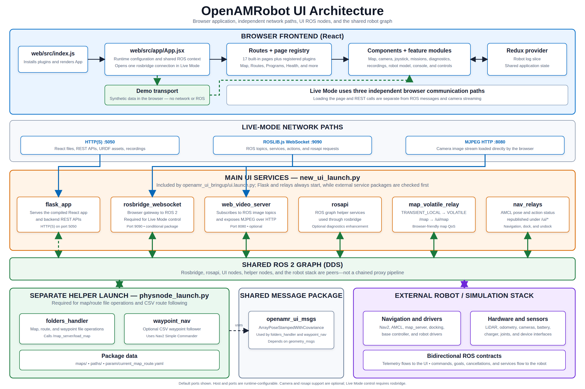

# OpenAMRobot UI

OpenAMRobot UI is a browser dashboard for watching and controlling an
autonomous mobile robot. It gives operators one place to see the live map,
check where the robot is, drive it with a joystick, send it to saved locations,
watch the camera view, dock it, build simple routines without writing code,
inspect its 3D model, register external hardware, check overall system health,
and record or replay sessions for debugging and demos. Beyond single-robot
operation it also covers scheduled and multi-step missions, a small robot
fleet roster, a live log console and parameter editor, and a metrics/events
track record — with a one-tap E-STOP always visible. A built-in Demo Mode
and a guided help system let you explore the whole interface with no robot
connected at all, and the page list itself is extensible: a working example
plugin ships in the repo showing how to add a new page without touching core
routing or navigation code.

https://github.com/user-attachments/assets/a2007c67-8fa3-449c-ae97-f2aaa151666b

Behind the scenes, this repository holds the web dashboard and the small ROS 2
pieces that help the browser talk to the robot. The main robot or simulation
workspace still starts the robot, navigation, localization, sensors, map server,
and simulator tools. This workspace focuses on the user interface: it serves the
web page, opens the browser-to-ROS connection, streams camera images when
available, and passes selected robot updates to the dashboard.

This README is a practical reference: install, build, run, and troubleshoot.
For how the system actually works — the two-workspace model, ROS 2 concepts,
the browser-to-ROS connection chain, why relay nodes exist, what each page
does, how failures and reconnection work, and how to safely extend the UI —
see the numbered lessons starting at
[`docs/lessons/`](docs/lessons/README.md) (or jump straight to the
[glossary](docs/lessons/glossary.md) for a quick term lookup), and the
hands-on guides in [`docs/extending/`](docs/extending/README.md).

Quick start order:

1. Choose one installation method: Docker Compose or manual install.
2. Start the robot or simulation workspace.
3. Start the UI launch from this workspace.
4. Open the browser at `http://127.0.0.1:5050/`.
5. Confirm the UI says ROS is connected before driving or sending goals.

No robot handy yet? Open `/config` and switch on **Demo Mode** — every page
fills in with believable simulated telemetry (clearly labeled as simulated)
so you can explore the whole interface first. A first-run guide also offers
this as a choice the first time the UI loads in a browser.



## What This UI Provides

- Browser dashboard served by Flask on port `5050`
- ROS communication through `rosbridge_websocket` on port `9090`
- Camera/image streaming through `web_video_server` on port `8080` when that
  service is installed and running
- Map display through a `/map` to `/ui/map` QoS relay
- AMCL pose and navigation/docking status relays under `/ui/*`
- Manual robot control through `/cmd_vel`
- Goal pose, initial pose, route, map, waypoint, docking, and status controls
- Blockly visual robot programming at `/blocks` for building simple robot
  action programs without writing code
- Map and route file management when the optional UI helper nodes are running
- A 3D robot model viewer at `/robot`, rendered from the real URDF/Xacro
  description — a safe, offline "Description Mode" for exploring the model,
  and a "Live Mode" that overlays real pose, path, and joint telemetry
- A manual device registry at `/devices` for USB/CAN/network/Raspberry-Pi
  hardware, with live status wherever a ROS topic is available and real
  serial-port detection on the host running the backend
- A System Health Centre at `/health` rolling up the ROS connection, live
  topics, TF, Nav2 lifecycle, registered devices, and battery into one
  overall Ready / Warning / Not-ready status, with clickable issues; the
  same rollup is also reused on the Config and Fleet pages
- Rosbag recording and replay at `/recordings`, backed by real `ros2 bag
  record`/`play` processes — useful for debugging, demos, and lessons
- A time-triggered Scheduler at `/scheduler` (send the robot home or to a
  saved waypoint on a schedule) and a multi-step Missions builder at
  `/missions` (chain waypoints, waits, and dock/undock into one sequence,
  runnable on its own or triggered from the Scheduler) — both run in the
  browser tab, not as robot-side autonomy, so keep a tab open for them to fire
- A Metrics page (`/metrics`) tracking distance, uptime, and goal/dock
  success rates over time, and an Events page (`/events`) with a
  filterable, exportable timeline of navigation/docking/battery/safety events
- A live Console (`/console`) for `/rosout` and arbitrary topic echo, a
  Parameters page (`/params`) for reading/setting Nav2 parameters on running
  nodes, and a Fleet page (`/fleet`) for managing a small roster of robots
  and switching which one this browser controls
- A Maps page (`/maps`) to save, switch, rename, and organize the robot's
  maps, including build/save-map actions when the optional helper node
  (`physnode_launch.py`) is running
- An always-visible status bar with connection state, battery, and a
  one-tap software E-STOP, reachable from any page
- A downloadable diagnostic support-package export (from the Health Centre)
  bundling connection info, the health rollup, recent events, a metrics
  snapshot, runtime config, and Nav2 parameters for offline troubleshooting
- Demo Mode (toggle on the Config page): explore every page with believable
  simulated telemetry, no robot or ROS connection required, including a
  guided-tasks flow from the first-run onboarding guide
- A first-run onboarding guide and an in-app "?" help widget with
  page-specific tips and a guided tour of the Map page
- Saved robot connection profiles and an optional `AUTH_MODE` deployment
  guard that warns when the UI is reachable from outside the local network
- An extensible page/device-type registry (`web/src/pages/registry.js`) with
  manifest validation and version compatibility checks — a real working
  example plugin ships at `web/src/plugins/notesPlugin/` showing how to add
  a page without editing core routing or navigation code

## Repository Layout

```text
openamrobot-ui/
  Dockerfile                  # Container image for the UI workspace
  docker-compose.yml          # One-command Docker Compose launcher
  README.md
  docs/
    lessons/                   # Numbered conceptual lessons (theory)
    extending/                 # Hands-on guides for adding panels/devices
  scripts/
    build_frontend.sh          # Install web deps and build React
    sync_frontend_to_ros.sh    # Copy React build into ROS package static/app
    build_ros.sh               # Build ros2/ with colcon
    container_entrypoint.sh    # Container startup script
    run_ui_backend.sh          # Run the recommended UI launch
  web/
    package.json               # React scripts and dependencies
    public/ros/                # roslibjs, ros2d, nav2d browser libraries
    src/                       # React app source, including Blockly features
  ros2/
    src/openamr_ui_msgs/       # Custom UI messages
    src/openamr_ui_package/    # Main ROS 2 UI package
    src/openamr_ui_bringup/    # Small launch wrapper
```

Generated folders are intentionally ignored:

```text
web/node_modules/
web/build/
ros2/build/
ros2/install/
ros2/log/
```

## Documentation Layout

This top-level README is the practical reference for installing, building,
running, and troubleshooting the UI workspace — not for how the system works
conceptually. That material lives in `docs/lessons/` and `docs/extending/`.
Folder-level README files are intentionally short and only describe local
package or directory details.

README index:

| README                                                                                                                                     | Use It For                                                                            |
| ------------------------------------------------------------------------------------------------------------------------------------------ | ------------------------------------------------------------------------------------- |
| [README.md](README.md)                                                                                                                     | Full workspace setup, launch, usage, and troubleshooting                              |
| [docs/lessons/](docs/lessons/README.md)                                                                                                    | Index of all 13 numbered lessons: what the UI is, ROS 2 concepts, data flow, backend nodes, the pages and components, the map/route file model, Blockly, the topic contract, failure modes, and debugging |
| [docs/lessons/glossary.md](docs/lessons/glossary.md)                                                                                       | One-page term lookup across all lessons                                               |
| [docs/extending/](docs/extending/README.md)                                                                                                | Router page: which hands-on guide to use                                              |
| [docs/extending/add-a-ui-panel.md](docs/extending/add-a-ui-panel.md)                                                                       | Hands-on guide: adding a new panel or page                                            |
| [docs/extending/connect-external-device.md](docs/extending/connect-external-device.md)                                                     | Hands-on guide: wiring up a new sensor/actuator/topic                                 |
| [docs/extending/add-a-blockly-block.md](docs/extending/add-a-blockly-block.md)                                                             | Hands-on guide: adding a new Blockly block                                            |
| [docs/extending/worked-example-adding-a-sensor.md](docs/extending/worked-example-adding-a-sensor.md)                                       | Complete worked example combining the panel and device guides                         |
| [web/README.md](web/README.md)                                                                                                             | React frontend development notes                                                      |
| [web/src/features/blocks/README.md](web/src/features/blocks/README.md)                                                                     | Blockly setup, block reference, examples, execution, screenshots, and troubleshooting |
| [scripts/README.md](scripts/README.md)                                                                                                     | Helper script details                                                                 |
| [ros2/src/openamr_ui_package/README.md](ros2/src/openamr_ui_package/README.md)                                                             | ROS 2 UI package overview                                                             |
| [ros2/src/openamr_ui_package/launch/README.md](ros2/src/openamr_ui_package/launch/README.md)                                               | Launch file notes                                                                     |
| [ros2/src/openamr_ui_package/maps/README.md](ros2/src/openamr_ui_package/maps/README.md)                                                   | Map directory structure and usage                                                     |
| [ros2/src/openamr_ui_package/paths/README.md](ros2/src/openamr_ui_package/paths/README.md)                                                 | Route/path directory structure and usage                                              |
| [ros2/src/openamr_ui_package/param/README.md](ros2/src/openamr_ui_package/param/README.md)                                                 | Configuration details                                                                 |
| [ros2/src/openamr_ui_package/resource/README.md](ros2/src/openamr_ui_package/resource/README.md)                                           | ROS package resource marker notes                                                     |
| [ros2/src/openamr_ui_package/openamr_ui_package/README.md](ros2/src/openamr_ui_package/openamr_ui_package/README.md)                       | Python package modules and backend nodes                                              |
| [ros2/src/openamr_ui_package/openamr_ui_package/static/README.md](ros2/src/openamr_ui_package/openamr_ui_package/static/README.md)         | Static frontend asset directory notes                                                 |
| [ros2/src/openamr_ui_package/openamr_ui_package/static/app/README.md](ros2/src/openamr_ui_package/openamr_ui_package/static/app/README.md) | React build output directory notes                                                    |
| [ros2/src/openamr_ui_package/openamr_ui_package/templates/README.md](ros2/src/openamr_ui_package/openamr_ui_package/templates/README.md)   | Flask templates directory notes                                                       |
| [ros2/src/openamr_ui_package/openamr_ui_package/submodules/README.md](ros2/src/openamr_ui_package/openamr_ui_package/submodules/README.md) | Optional backend submodule notes                                                      |

Generated install copies under `install/` and build output folders are not
listed here. Edit the source README files above instead.

## Main Components

| Component                  | Purpose                                                                                 |
| -------------------------- | --------------------------------------------------------------------------------------- |
| `web/`                     | React frontend source for the browser UI                                                |
| `web/src/features/blocks/` | Blockly block definitions, toolbox categories, robot action executor, and Blockly guide |
| `openamr_ui_msgs`          | Custom message package used by the UI                                                   |
| `openamr_ui_package`       | Flask server, relays, map/route handlers, waypoint navigation helpers                   |
| `openamr_ui_bringup`       | Recommended UI-only launch wrapper                                                      |
| `scripts/`                 | Canonical build and sync commands                                                       |
| `Dockerfile`               | Builds the React app, syncs it into the ROS package, and builds the ROS 2 workspace     |
| `docker-compose.yml`       | Starts the compiled UI workspace with one Docker Compose command                        |

The compiled React app is copied into:

```text
ros2/src/openamr_ui_package/openamr_ui_package/static/app/
```

During `colcon build`, that static app is installed into the package share
directory and served by `openamr_ui_package.flask_app`.

## Installation Options

Choose one installation method. Docker Compose and manual installation are
alternatives, so do not run both UI instances at the same time on the same
ports.

| Method                        | Best For                                            | Main Command                |
| ----------------------------- | --------------------------------------------------- | --------------------------- |
| Option A: Docker Compose      | Beginners, clean machines, quick demos, WSL testing | `docker compose up --build` |
| Option B: Manual Install      | Developers, robot computers, ROS debugging          | Build frontend, sync, build |
| Robot or simulation workspace | Nav2, localization, docking, sensors, Gazebo/RViz   | Run separately              |

Both installation methods start only this UI workspace. The robot or simulation
stack must still run separately unless that stack is also containerized.

## Option A: Docker Compose Install

For Docker Compose, install only Docker Engine and the Docker Compose plugin.
The container installs the UI build dependencies inside the image.

Docker Compose is the easiest way to try the UI on a clean Linux or WSL
machine. It installs the required Ubuntu, Node.js, npm, ROS 2 Jazzy, rosbridge,
web video, Nav2 message, and Python packages inside a container, then builds
the frontend and ROS 2 workspace during the image build.

If Docker is not installed yet, use the official Docker instructions for your
machine:

| System                  | Recommended Guide                                                                 |
| ----------------------- | --------------------------------------------------------------------------------- |
| Ubuntu/Linux            | [Install Docker Engine on Ubuntu](https://docs.docker.com/engine/install/ubuntu/) |
| Windows with WSL        | [Docker Desktop WSL 2 backend](https://docs.docker.com/desktop/features/wsl/)     |
| macOS or Docker Desktop | [Install Docker Desktop](https://docs.docker.com/desktop/)                        |

Check Docker first:

```bash
docker --version
docker compose version
```

Clone or place this repository at:

```bash
cd ~
git clone https://github.com/openAMRobot/openamrobot-ui.git openamrobot-ui
cd ~/openamrobot-ui
```

Start the UI workspace from the repository root:

```bash
docker compose up --build
```

Open the UI:

```text
http://127.0.0.1:5050/
```

Open Blockly:

```text
http://127.0.0.1:5050/blocks
```

The Compose service uses `network_mode: host`. This is recommended on Linux and
WSL because ROS 2 discovery, rosbridge, and browser access work more reliably
when the container shares the host network. With host networking, the UI listens
on the normal ports:

| Service          | URL or Port             |
| ---------------- | ----------------------- |
| Flask web UI     | `http://127.0.0.1:5050` |
| ROSBridge        | `ws://127.0.0.1:9090`   |
| Web video server | `http://127.0.0.1:8080` |

Useful Docker Compose commands:

```bash
# Start and rebuild if Dockerfile or package dependencies changed
docker compose up --build

# Start in the background
docker compose up -d

# Show logs
docker compose logs -f

# Stop the UI container
docker compose down

# Rebuild frontend and ROS workspace again when the container starts
OPENAMR_REBUILD_ON_START=1 docker compose up
```

If you are using Docker Desktop without working host networking, replace
`network_mode: host` in `docker-compose.yml` with explicit port mappings:

```yaml
ports:
  - "5050:5050"
  - "9090:9090"
  - "8080:8080"
```

This can open the browser UI, but ROS 2 discovery between the container and an
external robot/simulation may still need extra Docker Desktop networking setup.
For real robot testing on Linux or WSL, keep host networking.

## Option B: Manual Install

Use manual installation when you want to develop the frontend, edit ROS
packages, debug `colcon` builds, or run directly on a robot computer.

Recommended environment:

- Ubuntu 24.04 with ROS 2 Jazzy
- Python 3
- `colcon`
- Node.js 18 or newer
- npm
- A running OpenAMR robot or simulation stack for full UI functionality

Before installing this UI workspace, ROS 2 Jazzy should already be installed and
sourceable:

```bash
source /opt/ros/jazzy/setup.bash
ros2 pkg prefix rclpy
```

Check Node.js before building the frontend:

```bash
node --version
npm --version
```

If `node --version` reports an older major version than 18, install a newer
Node.js from your preferred Node.js package source before running the frontend
build. Some Ubuntu `apt` sources may provide an older Node.js version.

Install common system dependencies:

```bash
sudo apt update
sudo apt install -y \
  python3-colcon-common-extensions \
  python3-rosdep \
  nodejs \
  npm \
  ros-jazzy-rosbridge-server \
  ros-jazzy-rosapi \
  ros-jazzy-web-video-server \
  ros-jazzy-nav2-msgs \
  ros-jazzy-nav2-simple-commander \
  python3-flask \
  python3-yaml \
  python3-serial
```

The ROS package also uses normal ROS interfaces such as `rclpy`, `std_msgs`,
`geometry_msgs`, `nav_msgs`, `action_msgs`, and Nav2-related packages available
from a complete ROS/Nav2 installation.

If `rosdep` is available, run it from the ROS workspace to install any missing
package dependencies declared by the ROS packages:

```bash
cd ~/openamrobot-ui/ros2
source /opt/ros/jazzy/setup.bash
rosdep update
rosdep install --from-paths src --ignore-src -r -y
```

If `rosdep` reports keys that cannot be resolved, install the matching ROS
Jazzy or Python packages manually, then rerun the build.

Clone or place this repository at:

```bash
cd ~
git clone https://github.com/openAMRobot/openamrobot-ui.git openamrobot-ui
cd ~/openamrobot-ui
```

Build the frontend:

```bash
bash scripts/build_frontend.sh
```

Sync the frontend build into the ROS package:

```bash
bash scripts/sync_frontend_to_ros.sh
```

Build the ROS 2 workspace:

```bash
cd ~/openamrobot-ui/ros2
source /opt/ros/jazzy/setup.bash
colcon build --symlink-install
source install/setup.bash
```

You can also use the helper script:

```bash
cd ~/openamrobot-ui
source /opt/ros/jazzy/setup.bash
bash scripts/build_ros.sh
source ros2/install/setup.bash
```

After the build finishes, confirm the UI packages are visible:

```bash
cd ~/openamrobot-ui/ros2
source /opt/ros/jazzy/setup.bash
source install/setup.bash
ros2 pkg list | grep openamr_ui
```

## Running the UI

Start the robot or simulation stack first in its own terminal. For example,
from the main OpenAMR platform workspace:

```bash
cd ~/openamr-platform-sw
source install/setup.bash
ros2 launch openamrobot_docking bringup_sim.launch.py
```

Then start this UI workspace in another terminal:

```bash
cd ~/openamrobot-ui/ros2
source /opt/ros/jazzy/setup.bash
source install/setup.bash
ros2 launch openamr_ui_bringup ui.launch.py
```

Open the UI:

```text
http://127.0.0.1:5050/
```

If you are running on a robot or another computer, replace `127.0.0.1` with the
robot/computer IP address:

```text
http://<robot-ip>:5050/
```

Full UI functionality requires the robot or simulation workspace to already be
publishing the expected ROS topics. This UI workspace starts the browser,
rosbridge, camera web server, and browser-friendly relays; it does not start the
full robot, Nav2, localization, map server, sensors, docking, or simulator.

After launching the UI, these commands are useful quick checks:

```bash
ros2 node list | grep -E "flask_app|rosbridge|camera|map_volatile_relay|nav_relays"
ros2 topic list | grep -E "^/map$|^/ui/map$|^/odom$|^/tf$|^/tf_static$"
```

Expected UI-side nodes include `flask_app`, `rosbridge_websocket`,
`camera` (web_video_server), `map_volatile_relay`, and `nav_relays`. Expected
robot-side topics for basic map and motion display include `/map`, `/odom`,
`/tf`, and `/tf_static`.

## Blockly Robot Programming

For how the Blockly page actually works — the block-to-ROS pipeline and how
Voice Command fits in — see
[Lesson 09 — Blockly Visual Programming](docs/lessons/09-blockly-programming.md).
This section is the practical quick-start.

The UI includes a Blockly page for building simple robot programs by dragging
blocks instead of writing code. Open it after the UI launch is running:

```text
http://127.0.0.1:5050/blocks
```

The Blockly page can build programs with actions such as:

```text
start robot program
  navigate to x 1.5 y 0 yaw 0
  wait until navigation complete timeout 60 seconds
  dock robot
```

Every `navigate to x/y/yaw` or `navigate to location` block automatically
waits for Nav2 to report arrival (60s default timeout) before the next block
runs. Add an explicit `wait until navigation complete timeout N seconds`
block yourself only if you need a different timeout than the default.

Common Blockly categories include:

| Category    | Examples                                                                         |
| ----------- | -------------------------------------------------------------------------------- |
| Program     | start, repeat, log                                                               |
| Navigation  | navigate to coordinates, navigate to named location, wait for navigation, patrol |
| Motion      | wait, set speed, drive for time, rotate for time, stop movement, emergency stop  |
| Docking     | dock, undock                                                                     |
| Robot State | battery condition, set mode                                                      |

The Blockly editor supports browser Save/Load, JSON Import/Export, backend
saved programs, backend named locations, program templates, run history, and
plan validation. The `Run` button requires ROSBridge to be connected. Direct
motion blocks publish to `/cmd_vel`, navigation blocks publish goal poses, and
docking blocks publish the docking trigger topics.

For installation details, full block reference, examples, safety notes, and
troubleshooting, see:

```text
web/src/features/blocks/README.md
```

The Blockly page also includes a `Voice Command` panel that turns spoken
instructions into blocks via the Anthropic (Claude) API. Tap the mic and say
"Monsieur" followed by a command (e.g. "Monsieur, navigate to x 1 y 1 yaw 0,
then wait 3 seconds, then dock") — the transcript only appears once the wake
word is heard. This needs an API key: copy
`ros2/src/openamr_ui_package/.env.example` to `.env` in that same directory
and set `ANTHROPIC_API_KEY` (see
[launch/README.md](ros2/src/openamr_ui_package/launch/README.md)). Details
and troubleshooting are in the blocks README linked above.

When changing Blockly code, rebuild and reinstall the frontend before testing
through Flask:

```bash
cd ~/openamrobot-ui
bash scripts/build_frontend.sh
bash scripts/sync_frontend_to_ros.sh
cd ros2
colcon build --packages-select openamr_ui_package
source install/setup.bash
```

Then restart the UI launch and hard refresh the browser with `Ctrl+Shift+R`.

## Simulation, Headless Mode, and Gazebo GUI

For normal UI testing, launch the platform simulation headlessly from the main
`openamr-platform-sw` workspace, then launch this UI workspace separately.
This keeps the UI independent from the platform workspace.

```bash
# Terminal 1: headless platform simulation
cd ~/openamr-platform-sw
source install/setup.bash
ros2 launch openamrobot_docking bringup_sim.launch.py gazebo_gui:=false use_rviz:=false
```

```bash
# Terminal 2: web UI
cd ~/openamrobot-ui/ros2
source /opt/ros/jazzy/setup.bash
source install/setup.bash
ros2 launch openamr_ui_bringup ui.launch.py
```

Then open:

```text
http://127.0.0.1:5050/
```

This starts the recommended independent UI mode:

```text
Gazebo GUI: off
RViz: off
UI: on, from the separate openamrobot-ui workspace
```

Use Gazebo GUI mode only when you need to inspect the world, physics,
collisions, sensor placement, or robot movement visually. In that case, run the
simulation and UI separately:

```bash
# Terminal 1: platform simulation with Gazebo GUI/RViz
cd ~/openamr-platform-sw
source install/setup.bash
ros2 launch openamrobot_docking bringup_sim.launch.py
```

```bash
# Terminal 2: web UI
cd ~/openamrobot-ui/ros2
source /opt/ros/jazzy/setup.bash
source install/setup.bash
ros2 launch openamr_ui_bringup ui.launch.py
```

The old `headless:=true` / `headless:=false` arguments and the former
`use_ui:=true` platform shortcut are not used by the current independent UI
setup.

## Launch Options

Recommended UI-only launch:

```bash
ros2 launch openamr_ui_bringup ui.launch.py
```

Direct package launch for the web services and relays:

```bash
ros2 launch openamr_ui_package new_ui_launch.py
```

Helper script equivalent:

```bash
bash scripts/run_ui_backend.sh
```

The UI launch mainly starts web, bridge, camera, and relay nodes. The robot or
simulation workspace owns Nav2, localization, and the map server, so configure
simulation time there when needed.

Route and map file-management features need the optional helper launch:

```bash
ros2 launch openamr_ui_package physnode_launch.py
```

Run this only when you need UI actions that create, rename, delete, save, or
load map and route files, or when you need the route-following helper. The
normal dashboard, map display, manual driving, camera, and status panels use the
recommended `openamr_ui_bringup ui.launch.py` launch.

## Ports and URLs

Defaults are configured in:

```text
ros2/src/openamr_ui_package/param/config.yaml
```

| Service          | Default                 | Used For                 |
| ---------------- | ----------------------- | ------------------------ |
| Flask app        | `http://127.0.0.1:5050` | Serves the React UI      |
| Rosbridge        | `ws://127.0.0.1:9090`   | Browser to ROS WebSocket |
| Web video server | `http://127.0.0.1:8080` | Camera/image streams     |

For access from another computer, tablet, or touchscreen on the same WiFi, make
sure the browser device can reach the robot or UI computer on these ports:

| Port   | Protocol  | Must Be Reachable For                                |
| ------ | --------- | ---------------------------------------------------- |
| `5050` | HTTP      | Opening the web UI                                   |
| `9090` | WebSocket | ROS status, topics, commands, map, and robot control |
| `8080` | HTTP      | Camera/image streaming                               |

The WiFi/router must allow devices to talk to each other. Guest networks,
client isolation, AP isolation, VPN routing, and local firewalls can block the
UI even when both devices are connected to the same network.

### Access Model (`AUTH_MODE`)

There is no login by default — `AUTH_MODE` defaults to `open`, meaning anyone
who can reach the configured ports can view and operate the robot. This is
intentional for local-network, single-operator, and classroom use. Set the
`AUTH_MODE` environment variable before launching if you want the UI to warn
about it explicitly:

```bash
AUTH_MODE=open ros2 launch openamr_ui_bringup ui.launch.py
```

The dashboard shows a dismissible warning banner whenever a browser reaches
it from outside the local network while `AUTH_MODE=open`. `local` and
`external` are reserved values for future authenticated modes; setting
either one today falls back to `open` with a loud warning (both in the
banner and the server log) rather than silently pretending authentication is
active — check `GET /api/auth/status` to see the effective mode. Don't
expose these ports to the public internet.

The React development server runs on:

```text
http://localhost:3000
```

When running through Flask, the frontend connects to rosbridge using the page
hostname. When running through `localhost:3000`, it falls back to
`ROSBRIDGE_SERVER_IP` in:

```text
web/src/shared/constants/index.js
```

Update that IP if your robot is not at the default `192.168.0.100`.

For reliable robot use across reboots or WiFi changes, reserve a stable IP for
the robot or UI computer in the router DHCP settings, or update the dev-server
fallback IP before running `npm run dev`.

## Using the Web UI

There is no separate "Control" page — manual driving, docking, and live
telemetry live directly on the Map page (`/`), alongside an always-visible
status bar (connection, battery, E-STOP) available from every page.

The app has these main routes:

| Page       | URL           | Purpose                                                          |
| ---------- | ------------- | ------------------------------------------------------------------ |
| Map        | `/`           | Map view, robot pose, goals, manual driving, docking, waypoints   |
| Routes     | `/route`      | Route and waypoint sequence management                            |
| Maps       | `/maps`       | Save, switch, rename, and organize the robot's maps                |
| Programs   | `/blocks`     | Blockly visual robot programming                                  |
| Scheduler  | `/scheduler`  | Time-triggered single-action tasks (e.g. go home every evening)    |
| Missions   | `/missions`   | Multi-step missions — waypoints, waits, dock/undock, chained       |
| Status     | `/info`       | Camera, telemetry, battery, and system health                     |
| Robot      | `/robot`      | 3D URDF model viewer — Description Mode and Live Mode              |
| Devices    | `/devices`    | Manual external-device registry with live status                  |
| Health     | `/health`     | Overall system-readiness rollup with clickable issues              |
| Metrics    | `/metrics`    | Cumulative distance, uptime, and goal/dock success track record   |
| Recordings | `/recordings` | Rosbag record/replay for debugging, demos, and lessons             |
| Events     | `/events`     | Filterable, exportable event timeline                              |
| Console    | `/console`    | Live `/rosout` and arbitrary topic echo                            |
| Parameters | `/params`     | Read/set Nav2 parameters on running nodes                          |
| Fleet      | `/fleet`      | Multi-robot roster; switch which robot this browser controls       |
| Config     | `/config`     | Connection settings, saved profiles, Demo Mode, safety limits       |
| Notes      | `/notes`      | Example plugin page (not core — see Extension SDK below)           |

Every page also has a "?" help button (bottom-right) with page-specific tips,
and the Map page includes a short guided tour.
[Lesson 06 — A Tour of Every Page](docs/lessons/06-the-pages.md) walks
through all of the pages above with a real screenshot each, and
[Lesson 09 — Blockly Visual Programming](docs/lessons/09-blockly-programming.md)
is the deep dive on the Programs page specifically.
The page/nav list itself is data-driven from `web/src/pages/registry.js` — a
new page is added there, not by editing routing or the sidebar directly.

### Extension SDK

A contributor can add a page without touching `registry.js`, `Header.jsx`, or
any routing code, by calling `registerPage()` (for a new top-level page) or
`registerDeviceType()` (for a new Devices connection type) through the
validating wrapper in `web/src/shared/plugins/registerPlugin.js`, which
checks the plugin's manifest against `web/src/shared/plugins/pluginSchema.js`
(required fields, a minimal `>=x.y.z` version-compatibility check) before
installing it. `web/src/plugins/notesPlugin/` is a real, working example — a
small localStorage-backed notes page — installed from a single line in
`web/src/index.js`. Copy that folder as a starting point for a real plugin.
There is no dynamic/remote plugin loading (fetching a third-party
`manifest.json` and evaluating remote JS) — plugins are installed from the
frontend source at build time, not loaded at runtime.

Typical operating flow:

1. Start the robot or simulation stack.
2. Start the UI launch from this repository.
3. Open `/`.
4. Confirm the ROS connection indicator shows connected.
5. Use manual control, map goal setting, route management, docking controls, and
   status panels as needed.
6. Use the route page to create, edit, save, rename, delete, and select routes
   when the optional helper nodes from `physnode_launch.py` are running.
7. Use map controls only when the Nav2 map server is available.

Hard-refresh the browser after rebuilding frontend assets:

```text
Ctrl+Shift+R
```

## Important ROS Topics

Every frontend topic, service, and action name is defined in one place:

```text
web/src/shared/constants/index.js
```

See [Lesson 10 — Topics as the Contract](docs/lessons/10-topics-as-the-contract.md)
for why that centralization matters, and
[`docs/extending/connect-external-device.md`](docs/extending/connect-external-device.md)
for how to add a new one.

Common topics:

| Topic                         | Direction       | Purpose                                                       |
| ----------------------------- | --------------- | ------------------------------------------------------------- |
| `/cmd_vel`                    | UI publishes    | Manual velocity commands                                      |
| `/odom`                       | UI subscribes   | Robot pose and velocity                                       |
| `/ui/map`                     | UI subscribes   | Browser-friendly occupancy grid relay                         |
| `/global_costmap/costmap`     | UI subscribes   | Global costmap layer (only while the Costmap layer is enabled) |
| `/scan_filtered`              | UI subscribes   | Laser scan layer                                              |
| `/plan`                       | UI subscribes   | Planned path                                                  |
| `/tf`, `/tf_static`           | UI subscribes   | Robot/map transforms                                          |
| `/ui/amcl_pose`               | UI subscribes   | Relayed AMCL pose                                             |
| `/ui/navigate_to_pose/status` | UI subscribes   | Relayed Nav2 goal status                                      |
| `/goal_pose`                  | UI publishes    | Navigation goal                                               |
| `/initialpose`                | UI publishes    | Initial localization pose                                     |
| `/ui_operation`               | UI publishes    | Map/route/navigation commands                                 |
| `/ui_message`                 | UI subscribes   | Messages from UI helper nodes                                 |
| `/nav_data_req`               | UI publishes    | Request map/group/route file data                             |
| `/nav_data_resp`              | UI subscribes   | Map/group/route file data response                            |
| `/new_way_point`              | UI publishes    | Route waypoint pose added from the route editor               |
| `/WP_req`                     | UI publishes    | Request waypoint data                                         |
| `/WayPoints_topic`            | UI subscribes   | Route waypoint array                                          |
| `/dock_trigger`               | UI publishes    | Docking request trigger                                       |
| `/undock_robot`               | UI publishes    | Undocking request trigger                                     |
| `/dock_trigger_status`        | UI subscribes   | Docking state string                                          |
| `/ui/dock_robot/status`       | Relay publishes | Relayed dock action status for browser-compatible consumers   |
| `/ui/undock_robot/status`     | Relay publishes | Relayed undock action status for browser-compatible consumers |
| `/battery_status`             | UI subscribes   | Battery status                                                |
| `/charge_station_connected`   | UI subscribes   | Charger connection status                                     |
| `/navigate_to_pose/_action/cancel_goal` | UI calls | Cancel the active Nav2 goal (service)                |
| `/compute_path_to_pose`       | UI calls        | Nav2 path-planning service used by Route page's `Plan`        |

## What the UI Launch Starts

`openamr_ui_package/launch/new_ui_launch.py` starts:

| Node                                   | Purpose                                      |
| -------------------------------------- | -------------------------------------------- |
| `openamr_ui_package/flask`             | Serves the React build                       |
| `rosbridge_server/rosbridge_websocket` | WebSocket bridge for roslibjs                |
| `rosapi/rosapi_node`                   | Optional ROS graph helper services           |
| `web_video_server/web_video_server`    | Optional browser camera streaming            |
| `openamr_ui_package/map_relay`         | Relays `/map` to `/ui/map`                   |
| `openamr_ui_package/nav_relay`         | Relays AMCL/navigation/docking status topics |

Additional helper nodes are available in `openamr_ui_package/launch/physnode_launch.py`
if map/route file operations or waypoint route-following helpers are needed:

| Node                         | Purpose                                            |
| ---------------------------- | -------------------------------------------------- |
| `openamr_ui_package/handler` | Map, group, route, and waypoint file operations    |
| `openamr_ui_package/nav`     | Route-following helper using Nav2 `BasicNavigator` |

## Frontend Development

Run the React dev server:

```bash
cd ~/openamrobot-ui/web
npm install
npm run dev
```

Open:

```text
http://localhost:3000
```

The frontend can render without ROS, but live robot data and controls require
rosbridge to be running and reachable.

Build production assets:

```bash
cd ~/openamrobot-ui
bash scripts/build_frontend.sh
bash scripts/sync_frontend_to_ros.sh
```

Rebuild the ROS package after syncing:

```bash
cd ~/openamrobot-ui/ros2
source /opt/ros/jazzy/setup.bash
colcon build --symlink-install --packages-select openamr_ui_package
source install/setup.bash
```

Run frontend linting:

```bash
cd ~/openamrobot-ui/web
npm run lint
```

Run frontend tests:

```bash
cd ~/openamrobot-ui/web
npm test
```

## ROS Development

Build all ROS packages:

```bash
cd ~/openamrobot-ui/ros2
source /opt/ros/jazzy/setup.bash
colcon build --symlink-install
source install/setup.bash
```

Build selected packages:

```bash
colcon build --symlink-install --packages-select openamr_ui_msgs openamr_ui_package openamr_ui_bringup
```

Run package tests:

```bash
colcon test --packages-select openamr_ui_package openamr_ui_msgs
colcon test-result --verbose
```

After changing message definitions in `openamr_ui_msgs`, rebuild and source the
workspace again before running any nodes:

```bash
colcon build --symlink-install --packages-select openamr_ui_msgs openamr_ui_package
source install/setup.bash
```

## Map and Route Files

Maps are stored under:

```text
ros2/src/openamr_ui_package/maps/
```

Routes are stored under:

```text
ros2/src/openamr_ui_package/paths/
```

The active map and route are tracked in:

```text
ros2/src/openamr_ui_package/param/current_map_route.yaml
```

Route CSV files contain waypoint pose data used by the route UI and waypoint
navigation helper. The UI helper node can create groups, save routes, edit
routes, rename routes/maps/groups, delete routes/maps/groups, and request the
current waypoint list.

## Normal Development Workflow

For frontend changes:

```bash
cd ~/openamrobot-ui
bash scripts/build_frontend.sh
bash scripts/sync_frontend_to_ros.sh

cd ~/openamrobot-ui/ros2
source /opt/ros/jazzy/setup.bash
colcon build --symlink-install --packages-select openamr_ui_package
source install/setup.bash
ros2 launch openamr_ui_bringup ui.launch.py
```

For Python or launch file changes:

```bash
cd ~/openamrobot-ui/ros2
source /opt/ros/jazzy/setup.bash
colcon build --symlink-install
source install/setup.bash
ros2 launch openamr_ui_bringup ui.launch.py
```

For message changes:

```bash
cd ~/openamrobot-ui/ros2
source /opt/ros/jazzy/setup.bash
colcon build --symlink-install --packages-select openamr_ui_msgs openamr_ui_package
source install/setup.bash
```

## Troubleshooting

If the page opens but ROS status is disconnected:

- Confirm `rosbridge_websocket` is running.
- Confirm port `9090` is reachable from the browser machine.
- If using the React dev server, update `ROSBRIDGE_SERVER_IP` in
  `web/src/shared/constants/index.js`.
- Check browser console WebSocket errors.

If the page does not open:

- Confirm the UI launch is still running.
- Confirm Flask is listening on port `5050`.
- Check `ros2/src/openamr_ui_package/param/config.yaml` for the configured host
  and port.

If the map is blank:

- Confirm the robot/simulation stack is publishing `/map`.
- Confirm `map_relay` is running.
- Check that the frontend is subscribed to `/ui/map`.
- Confirm the map server belongs to the main robot/Nav2 stack.

If camera is missing:

- Install `ros-jazzy-web-video-server`.
- Confirm `web_video_server` is running on port `8080`.
- Confirm the camera/image topic exists in ROS.

If UI changes do not appear:

- Rebuild the frontend.
- Sync `web/build` into the ROS package.
- Rebuild the ROS package.
- Hard-refresh the browser with `Ctrl+Shift+R`.

If `colcon` cannot find packages:

- Source ROS first with `source /opt/ros/jazzy/setup.bash`.
- Run commands from `~/openamrobot-ui/ros2`.
- Rebuild and source `install/setup.bash`.

## Notes

- Do not run a second standalone map server from this UI workspace when the
  main Nav2 stack already owns `/map_server`.
- `map_server_launch.py` is a deprecated compatibility launch and is namespaced
  under `ui_legacy` to avoid conflicting with the platform map server.
- Keep heavy UI layers such as camera, laser, and costmaps off unless needed for
  debugging, especially when simulation performance is tight.
- The UI is most useful when the robot or simulation stack is already healthy;
  use RViz and ROS CLI tools for deep Nav2, TF, or costmap debugging.

  ## 💜 Support OpenAMRobot

Support open-source robotics, ROS 2 development, AI robotics education, and dual-arm mobile robot research.

### ⚡ Back the build — one-time, no strings

| Tier | What it says about you | Link |
|---|---|---|
| ⚡ **First Mover - €5** | You got here first, and you didn't overthink it. Your name goes on the backers wall - permanently - as one of the people who moved before it was obvious. Five euros, one good instinct. | <a href="https://buy.stripe.com/eVqcN5b99eeAaSd7WPgUM06" target="_blank" rel="noopener noreferrer">💳&nbsp;Back&nbsp;it&nbsp;→</a> |
| 🎯 **Sharpshooter - €25** | You spotted it early and called it. Name on the wall + a shareable "OpenAMRobot Backer" badge - proof you saw it coming while everyone else was still scrolling. | <a href="https://buy.stripe.com/4gMdR9ell1rO2lH90TgUM07" target="_blank" rel="noopener noreferrer">💳&nbsp;Back&nbsp;it&nbsp;→</a> |
| 🕶️ **Insider - €50** | You want in behind the curtain. Everything above + the backer-only build log and early files - every breakthrough, every faceplant, unfiltered. You see it before the internet does. | <a href="https://buy.stripe.com/eVq14nfpp4E0gcx2CvgUM08" target="_blank" rel="noopener noreferrer">💳&nbsp;Back&nbsp;it&nbsp;→</a> |
| 🔩 **Immortal - €100** | Your name goes on the actual robot. Physically. Forever. A machine will roll around carrying your name long after any of us remember why - and you'll have the photo to prove you were there. | <a href="https://buy.stripe.com/00w00jdhhb2o4tPfphgUM09" target="_blank" rel="noopener noreferrer">💳&nbsp;Back&nbsp;it&nbsp;→</a> |
| 🏆 **Founding Backer - €250** | Not a supporter - a co-author. Everything above + a personal thank-you in a build video. When this becomes something, you were one of the people who decided it would. | <a href="https://buy.stripe.com/28EeVdcdddawaSdeldgUM0a" target="_blank" rel="noopener noreferrer">💳&nbsp;Back&nbsp;it&nbsp;→</a> |

### 🔁 Monthly subscriptions — build it with us, every month

| Tier | What you get | Link |
|---|---|---|
| 😇 **Benefactor - €5/mo** | This month, officially not wasted. €5 to help build an open robot for everyone - cheaper than the coffee you'll forget you bought. Your name goes on the wall. History will remember you - well, me for sure. 🤖 | <a href="https://buy.stripe.com/9B6cN5dhh9Yk7G1cd5gUM05" target="_blank" rel="noopener noreferrer">💳&nbsp;Subscribe&nbsp;→</a> |
| ❤️ **Community - €19/mo** | You're in. Community access, project & roadmap updates, basic documentation, and community Q&A. (Private consultation not included.) | <a href="https://buy.stripe.com/6oUcN55OPc6s3pL4KDgUM00" target="_blank" rel="noopener noreferrer">💳&nbsp;Subscribe&nbsp;→</a> |
| 🔧 **Builder - €79/mo** | For the ones who actually build. Everything in Community + builder docs, monthly group Q&A, selected tutorials, early design updates, and discounts on digital packs. (Private consultation not included.) | <a href="https://buy.stripe.com/14A28r0uvdaw9O9eldgUM01" target="_blank" rel="noopener noreferrer">💳&nbsp;Subscribe&nbsp;→</a> |
| 🚀 **Pro Support - €299/mo** | Expert support for advanced builders, early founders, and small labs. Includes 1 private consulting call per month and up to 3 hours/month of technical guidance. | <a href="https://buy.stripe.com/dRm4gz4KLdaw6BX4KDgUM02" target="_blank" rel="noopener noreferrer">💳&nbsp;Subscribe&nbsp;→</a> |
| 🏢 **Startup Support - €750/mo** | For robotics startups and teams heading toward a prototype. Includes 2 private consulting calls per month, roadmap support, GitHub/documentation review, supplier review, and up to 6 hours/month. | <a href="https://buy.stripe.com/7sY8wPfpp8Ugf8t90TgUM03" target="_blank" rel="noopener noreferrer">💳&nbsp;Subscribe&nbsp;→</a> |
| 🔬 **Lab Support - €1,500/mo** | For universities, corporate labs, and training centers. Includes 4 private sessions per month, lab implementation support, architecture reviews, training-roadmap support, and up to 10 hours/month. | <a href="https://buy.stripe.com/eVq14ndhh2vSaSda4XgUM04" target="_blank" rel="noopener noreferrer">💳&nbsp;Subscribe&nbsp;→</a> |

**❤️ GitHub Sponsors:** <a href="https://github.com/sponsors/openAMRobot" target="_blank" rel="noopener noreferrer"> 🐙 &nbsp;github.com/sponsors/openAMRobot&nbsp;→</a>

*Every contribution — €5 or €1,500 — literally builds this robot. No billion-dollar lab required. **You're not donating. You're building it.** 🤖*
