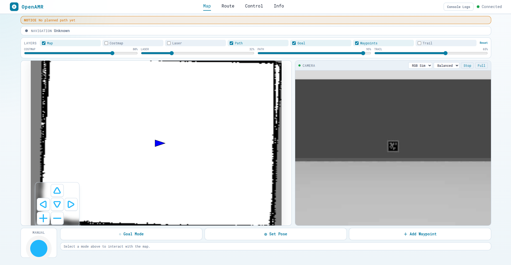
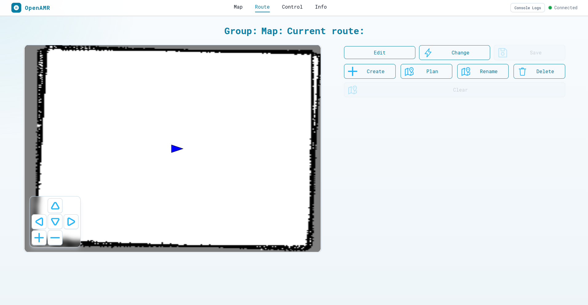
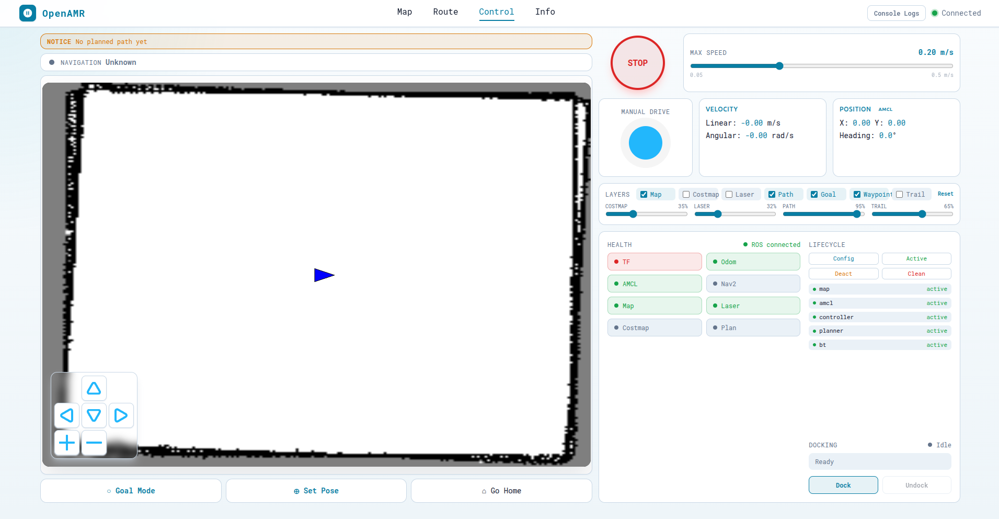
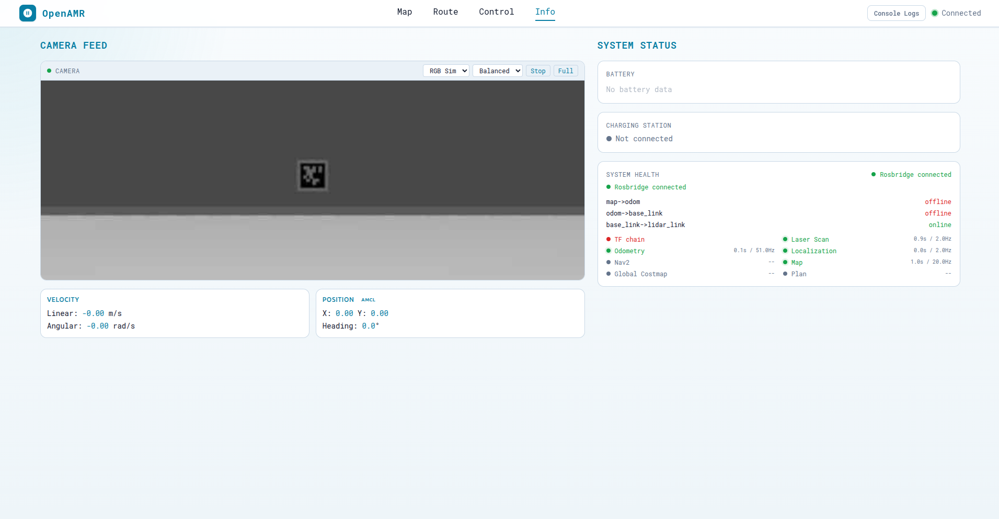
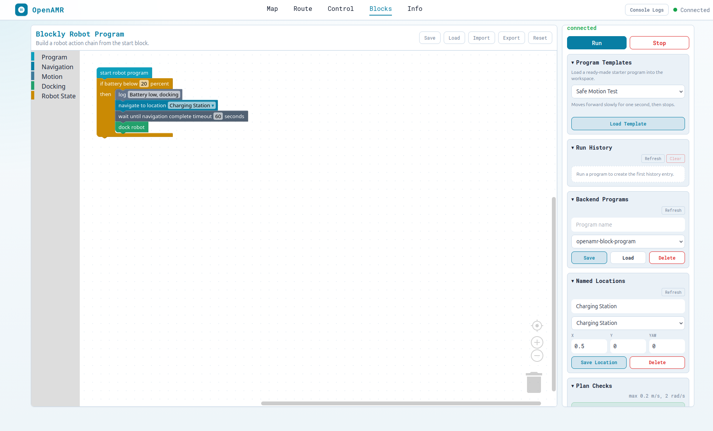

# Lesson 06 — The Five Pages

The dashboard has five pages: Map, Route, Control, Info, and Blocks. This
lesson covers the purpose and topic dependencies of all five at a glance.
Blocks gets a section here like the others, but it's different enough — a
visual programming editor, not just a set of panels — that it also gets a
full lesson of its own:
[Lesson 09 — Blockly Visual Programming](09-blockly-programming.md), plus the
practical
[`web/src/features/blocks/README.md`](../../web/src/features/blocks/README.md)
guide.

Each page is a route registered in
[`web/src/pages/index.jsx`](../../web/src/pages/index.jsx) and a matching
component in [`web/src/pages/`](../../web/src/pages/).

## Map — `web/src/pages/MapPage.jsx`

The situational-awareness page: "where is the robot, what does the map look
like, where do I want it to go." It renders the shared
[`Map`](../../web/src/components/Map.jsx) component (occupancy grid from
`/ui/map`, robot pose, optional overlays) beside the
[`Camera`](../../web/src/components/Camera.jsx) panel, plus a joystick for
manual nudges. Its three interaction modes publish to different topics: Goal
Mode and waypoint-queue execution publish `/goal_pose`, Set Pose publishes
`/initialpose`, and canceling an active goal calls the navigate-to-pose
cancel service. All three topic/service names come from
[`web/src/shared/constants/index.js`](../../web/src/shared/constants/index.js)
(`GOAL_POSE_TOPIC`, `INITIAL_POSE_TOPIC`, `NAV_CANCEL_GOAL_SERVICE`).

- The map panel shows the occupancy grid from `/ui/map`, the robot pose, and
  optional overlays (path, waypoints, goal, laser scan, costmap, trail) via
  the layer controls, with sliders for overlay opacity.
- `Goal Mode` publishes a navigation goal to `/goal_pose` (click and drag to
  set heading). `Set Pose` publishes `/initialpose` (use after localization
  is reset or wrong). `Add Waypoint` builds a temporary queue; `Execute
  Queue` sends each queued waypoint as a `/goal_pose` goal in turn.
- The camera panel uses `web_video_server` on port `8080`. If it's blank,
  confirm `web_video_server` is running and the selected image topic exists.

## Route — `web/src/pages/RoutePage.jsx`

The route-authoring page: builds and manages named, reusable waypoint
sequences for a given map, as opposed to the Map page's one-off goals. It
exchanges map/group/route file state with the `folders_handler` backend node
(started by
[`physnode_launch.py`](../../ros2/src/openamr_ui_package/launch/physnode_launch.py))
over `NAV_DATA_REQ_TOPIC`/`NAV_DATA_RESP_TOPIC` and `UI_OPERATION_TOPIC`, and
can ask Nav2 to auto-plan a path between two points via the
`COMPUTE_PATH_SERVICE` service, publishing the resulting waypoints on
`NEW_WAYPOINT_TOPIC`. See the constants of the same names in
[`web/src/shared/constants/index.js`](../../web/src/shared/constants/index.js).

- Route data is stored under `ros2/src/openamr_ui_package/paths/` and
  exchanged with the `folders_handler` helper node over `/nav_data_req`,
  `/nav_data_resp`, `/ui_operation`, and `/new_way_point`.
- `Create` starts a new route; place waypoints on the map. `Edit` loads the
  current route for changes (press again to cancel). `Change` opens the
  route selector. `Plan` asks Nav2's `/compute_path_to_pose` service for a
  path from the robot's current pose to a clicked goal, downsamples it, and
  publishes the points to `/new_way_point`. `Save` writes the route. `Rename`
  and `Delete` act on the current route. `Clear` removes the in-progress
  editor points.
- Routes belong to a specific map — check the group/map/route header before
  saving or reusing waypoints.
- Requires the optional helper launch (`physnode_launch.py`). If route
  buttons don't update anything, confirm `folders_handler` is running and
  `/nav_data_req`, `/nav_data_resp`, `/ui_operation`, `/ui_message` are
  moving.

## Control — `web/src/pages/ControlPage.jsx`

The operator page: driving, stopping, and supervising the robot in one
screen. It combines the map, a joystick publishing `/cmd_vel`, an emergency
stop, a speed-limit slider, and several status/diagnostic panels:
[`RobotState`](../../web/src/components/RobotState.jsx) (live pose/velocity),
[`SystemHealth`](../../web/src/components/SystemHealth.jsx) (is each expected
stream — TF, odom, AMCL, map, laser, costmap, plan — actually online; for
example, if the `map -> odom` TF link goes offline while `/odom` itself
stays online, that specifically points at a localization problem, not a
connectivity one, because raw odometry is still arriving but nothing is
transforming it into the map frame),
[`LifecycleStatus`](../../web/src/components/LifecycleStatus.jsx) (Nav2
lifecycle node states, via the `get_state`/`change_state` services on the
node list in `LIFECYCLE_NODES`), and
[`DockingControl`](../../web/src/components/DockingControl.jsx) (dock/undock
triggers and status). Unlike Map and Info, Control does not show the camera —
it prioritizes drive and status controls in the available space.

- Combines the map, manual drive, safety stop, speed limit, telemetry, layer
  toggles, lifecycle controls, health checks, and docking in one screen (no
  camera feed here — see Map or Info for that).
- The joystick publishes `/cmd_vel`; the max-speed slider caps the command
  range. `STOP` immediately zeroes velocity and cancels the active Nav2
  goal. `Goal Mode`/`Set Pose` behave as on the Map page; `Go Home` sends the
  robot to the default home pose.
- Velocity comes from odometry, position from AMCL/pose tracking — useful
  for telling a command problem from a localization problem.
- Lifecycle controls can configure/activate/deactivate/clean up
  lifecycle-managed Nav2 nodes; an offline/unknown row means the matching
  Nav2 node isn't running in the robot/simulation workspace.
- Docking publishes dock/undock triggers and reads status from
  `/dock_trigger_status`; after undocking, the UI also publishes a standby
  goal on `/goal_pose`. The robot stack must provide the docking behavior —
  the UI only exposes controls and status.

## Info — `web/src/pages/InfoPage.jsx`

The calm diagnostics page: camera, battery, charging status, and the same
`SystemHealth`/`RobotState` panels used on Control, without the extra control
surface. It's the page to check when you want to know "is data flowing"
without also exposing drive controls. Battery and charger topics come from
`BATTERY_TOPIC` and `CHARGE_STATION_CONNECTED` in
[`web/src/shared/constants/index.js`](../../web/src/shared/constants/index.js);
if no node publishes those topics, the page still works, it just shows "no
data" (the standard UI launch does not start a battery-publishing node by
default).

- Diagnostics-only view: camera, battery, charging, telemetry, and system
  health, without Control's drive/lifecycle/docking controls.
- Battery subscribes to `/battery_status`; charging status to
  `/charge_station_connected`. No data just means no node is publishing that
  topic (the standard UI launch does not start `battery.py`) — the UI keeps
  running fine either way.
- Velocity/position panels help separate a frontend connection problem from a
  navigation problem: if velocity updates but pose is stale, check
  localization/TF; if neither updates, check rosbridge, odometry, and the
  robot/simulation bringup.
- The system-health panel is the fastest place to check rosbridge state, TF
  links (`map->odom`, `odom->base_link`, `base_link->lidar_link`), and key
  streams (laser scan, localization, map, global costmap, plan, Nav2).
  Offline items point to a missing publisher, a stopped node, or a
  topic-name mismatch.

## Blocks — `web/src/pages/BlocksPage.jsx`

The visual-programming page: build a robot program by dragging blocks
instead of writing code, then press `Run` to execute it. Unlike the other
four pages, it doesn't publish/subscribe to individual topics directly from
the page component itself — it hands the shared `ros` connection to
`robotActions.js`, which creates the actual `ROSLIB.Topic`/`Service`
instances and executes each step of the program in turn. See
[Lesson 09](09-blockly-programming.md) for the full block → action →
execution pipeline, the block category reference, and how Voice Command
fits in — this section is just the at-a-glance summary the other four pages
got above.

- The left toolbox groups blocks into `Program`, `Navigation`, `Motion`,
  `Docking`, and `Robot State`. Only blocks connected below `start robot
  program` run — loose blocks on the workspace are ignored.
- The right panel shows ROSBridge status, `Run`/`Stop`, program templates,
  run history, backend saved programs, named locations, `Plan Checks`
  (validation warnings before execution), and the `Generated Plan` (the
  exact step list that will run).
- `Save`/`Load` use browser storage; `Import`/`Export` move programs as
  JSON files; `Reset` restores the starter program.
- `Voice Command` turns a spoken sentence (after the wake word "Monsieur")
  into blocks via the Flask backend and Claude — see
  [Lesson 09](09-blockly-programming.md#voice-command) for the full flow.

## The pattern across all five

The four panel-based pages follow the same shape: each reads the shared ROS
connection (see [Lesson 10](10-topics-as-the-contract.md)), creates
`ROSLIB.Topic`/`Service` instances bound to names pulled from the shared
constants file, subscribes or publishes, and cleans up on unmount. None of
them create their own ROS connection — they all share the one described in
[Lesson 03](03-how-the-browser-talks-to-ros.md). This is exactly the shape
[`docs/extending/add-a-ui-panel.md`](../extending/add-a-ui-panel.md) asks
you to follow for a new panel.

Blocks shares the same underlying rule — one shared connection, no page
creates its own — but reaches it through one extra layer of indirection
(`robotActions.js`) instead of wiring topics directly in the page component,
because a program's steps aren't known until the workspace is read at `Run`
time.

## Next

[Lesson 07 — UI Components in Detail](07-ui-components.md) drills into each
individual panel named above (Map/Route/Control/Info's building blocks) —
what it renders, exactly which topics/services it uses, and how its internal
state works.
