# OpenAMR Blockly Guide

This guide explains how to use and develop the Blockly robot programming page in
OpenAMR UI. It is written for beginners, so it starts from the basics and then
shows practical robot programs you can build with blocks.

## What Blockly Is

Blockly is a visual programming editor. Instead of writing code by hand, you
drag blocks onto a workspace and connect them together.

In this project, the Blockly page lets you create a robot action program like:

```text
start robot program
  navigate to x 1.5 y 0 yaw 0
  wait until navigation complete timeout 60 seconds
  dock robot
```

The UI converts those blocks into a robot plan, then sends ROS commands through
rosbridge when you press `Run`.

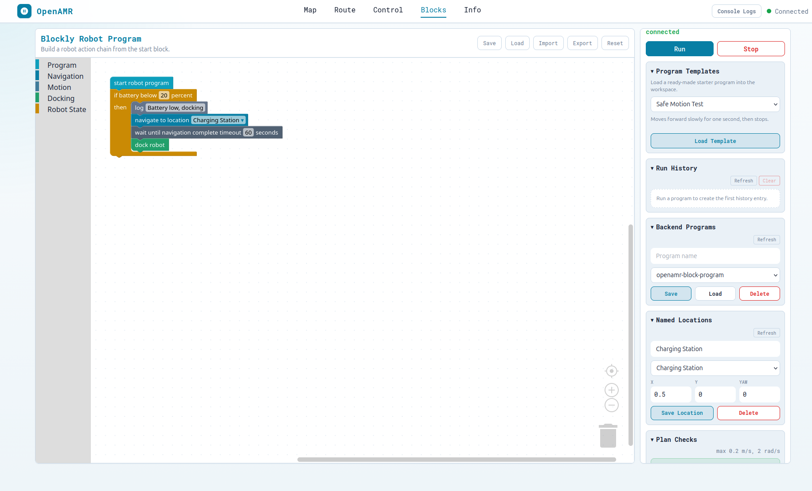

## Blockly Page Areas

The category screenshots later in this guide show the expected updated Blockly
toolbox. If your page looks different, compare it with the labels below.

| Area                          | What It Shows                                                           | How To Use It                                                                                                    |
| ----------------------------- | ----------------------------------------------------------------------- | ---------------------------------------------------------------------------------------------------------------- |
| Top navigation                | The main UI pages: Map, Route, Control, Blocks, and Info                | Click `Blocks` to open the Blockly robot-programming page                                                        |
| Page title                    | `Blockly Robot Program` and a short description                         | Confirms you are on the correct page                                                                             |
| Save/Load/Import/Export/Reset | Program storage buttons in the top right of the Blockly panel           | Save and Load use browser storage; Import and Export move Blockly JSON files; Reset restores the default program |
| Left toolbox                  | Block categories: Program, Navigation, Motion, Docking, and Robot State | Click a category, then drag blocks from the flyout into the workspace                                            |
| Workspace                     | The large dotted canvas in the center                                   | Drop blocks here and connect them below `start robot program`                                                    |
| Connected blocks              | The active program chain                                                | Only blocks connected under the main `start robot program` are converted into the Generated Plan                 |
| Loose blocks                  | Blocks placed on the workspace but not connected to the start chain     | Useful while building, but they do not run until connected under `start robot program`                           |
| Zoom controls                 | Plus, minus, and center controls on the right edge of the workspace     | Zoom in/out or recenter the block workspace                                                                      |
| Trash can                     | Delete area in the bottom-right of the workspace                        | Drag unwanted blocks to the trash, or select blocks and delete them                                              |
| ROSBridge status              | Connection state in the right panel                                     | `connected` means the browser can talk to ROS through rosbridge; `disconnected` means Run will be disabled       |
| Run and Stop                  | Execution buttons in the right panel                                    | Run executes the Generated Plan; Stop sends an emergency stop command                                            |
| Voice Command                 | Mic button and live transcript in the right panel                       | Tap the mic and say "Monsieur" followed by a command; Claude turns it into blocks in the workspace for you to review before Run |
| Program Templates             | Ready-made example programs in the right panel                          | Load a safe starter program, navigation example, docking sequence, patrol route, or low-battery routine          |
| Run History                   | Recent run results in the right panel                                   | Review success, failed, and stopped runs with timing and step counts                                             |
| Backend Programs              | Program name, saved-program dropdown, and Save/Load/Delete buttons      | Store Blockly programs on the Flask backend so they survive browser storage clearing                             |
| Named Locations               | Location name, location dropdown, and `x`, `y`, `yaw` fields            | Manage backend locations used by the `navigate to location` block                                                |
| Plan Checks                   | Validation warnings and speed-limit errors                              | Fix errors before Run; review warnings before sending commands to the robot                                      |
| Generated Plan                | Human-readable list of actions made from connected blocks               | Check this before pressing Run so you know what the robot will do                                                |

The right-side panels are collapsible. Close panels you are not using to keep
the page compact.

When building a program, you may see two kinds of block groups in the
workspace:

- A loose `start robot program` block that is not connected to robot actions.
  If the planner reads this empty start block, the Generated Plan can show
  `0 steps`.
- A connected program chain with actions below `start robot program`. This is
  the kind of chain you should run.

```text
start robot program
  navigate to x 1.5 y 0 yaw 0
  wait 2 seconds
  patrol A x 0 y 0 yaw 0 B x 2 y 0 yaw 3.14
  repeat 3 times wait 1 seconds
```

To avoid confusion, keep only one `start robot program` block in the workspace
when running a real robot.

The category screenshots below show the updated Blockly toolbox. The left
sidebar should contain:

```text
Program
Navigation
Motion
Docking
Robot State
```

If your sidebar still shows only:

```text
Program
Robot
```

you are seeing an old frontend bundle. Rebuild, sync, reinstall, restart the UI,
and hard refresh the browser. The exact commands are in
[Make Flask Serve The Updated Blocks](#make-flask-serve-the-updated-blocks).

## Where The Blockly Code Lives

```text
web/src/pages/BlocksPage.jsx
web/src/features/blocks/blockDefinitions.js
web/src/features/blocks/toolbox.js
web/src/features/blocks/robotActions.js
web/src/features/blocks/backendPrograms.js
web/src/features/blocks/backendLocations.js
web/src/features/blocks/backendRunHistory.js
web/src/features/blocks/planValidation.js
web/src/features/blocks/programTemplates.js
web/src/features/blocks/voiceCapture.js
web/src/features/blocks/voicePlan.js
```

| File                   | Purpose                                                                                 |
| ---------------------- | --------------------------------------------------------------------------------------- |
| `BlocksPage.jsx`       | Shows the Blockly workspace, toolbar, sidebar panels, Run/Stop buttons, and plan status |
| `blockDefinitions.js`  | Defines custom OpenAMR blocks, converts blocks into plan actions, and converts a plan back into Blockly JSON via `planToWorkspace()` |
| `toolbox.js`           | Controls which block categories and blocks appear in the left sidebar                   |
| `robotActions.js`      | Executes each generated action by publishing ROS messages or waiting for ROS status     |
| `backendPrograms.js`   | Calls the backend saved-program API                                                     |
| `backendLocations.js`  | Calls the backend named-location API                                                    |
| `backendRunHistory.js` | Calls the backend run-history API                                                       |
| `planValidation.js`    | Builds Plan Checks warnings and speed-limit errors                                      |
| `programTemplates.js`  | Defines ready-made Blockly starter programs                                             |
| `voiceCapture.js`      | Thin wrapper around the browser's `SpeechRecognition`/`webkitSpeechRecognition` API      |
| `voicePlan.js`         | Calls the backend `/api/voice-plan` endpoint with the transcript and known locations     |

## Requirements

You need:

- Ubuntu or Linux environment
- Node.js and npm for the React frontend
- ROS 2 for the Flask/ROS UI server
- A running robot or simulation if you want real robot movement
- rosbridge running so the browser can talk to ROS
- An Anthropic API key, only if you want to use the `Voice Command` panel (see
  [Voice Command](#voice-command))

The UI can open without a robot, but `Run` needs ROSBridge to be connected.

Check the basic tools:

```bash
node --version
npm --version
ros2 --help
colcon --help
```

If one of these commands is missing, install the missing tool first using the
main project README or your ROS 2 distribution instructions.

## Install Frontend Dependencies

From the repository root:

```bash
cd ~/openamrobot-ui/web
npm install
```

This installs React, Blockly, and other browser dependencies listed in
`web/package.json`.

If the project already has `package-lock.json` and you want a clean reproducible
install, use:

```bash
cd ~/openamrobot-ui/web
npm ci
```

## Beginner Setup From A Fresh Workspace

Use this sequence when setting up Blockly for the first time:

```bash
cd ~/openamrobot-ui/web
npm install
npm run build

cd ~/openamrobot-ui
bash scripts/sync_frontend_to_ros.sh

cd ~/openamrobot-ui/ros2
colcon build --packages-select openamr_ui_package
source install/setup.bash
```

Then start the UI:

```bash
ros2 launch openamr_ui_package new_ui_launch.py
```

Open:

```text
http://127.0.0.1:5050/blocks
```

## Run In Development Mode

Use this while editing React or Blockly code:

```bash
cd ~/openamrobot-ui/web
npm run dev
```

Open:

```text
http://localhost:3000/blocks
```

Development mode is useful because changes in `web/src` rebuild automatically.
If something looks stale, stop the dev server with `Ctrl+C`, start it again, and
hard refresh the browser with `Ctrl+Shift+R`.

Use development mode when you are editing code. Use Flask mode
(`http://127.0.0.1:5050/blocks`) when you want to test the installed ROS UI.

## Build For Production

From the frontend folder:

```bash
cd ~/openamrobot-ui/web
npm run build
```

This creates:

```text
web/build/
```

That build is not automatically served by the ROS Flask app. To make the ROS UI
serve the new frontend, continue with the next section.

## Make Flask Serve The Updated Blocks

The Flask app on port `5050` serves the installed ROS package, not the live
React source files. This means editing `web/src` alone is not enough for the
`5050` page.

After changing Blockly code, use this full update flow:

```bash
cd ~/openamrobot-ui
bash scripts/build_frontend.sh
bash scripts/sync_frontend_to_ros.sh
cd ros2
colcon build --packages-select openamr_ui_package
source install/setup.bash
```

Then stop the old UI launch if it is already running, and start it again:

```bash
ros2 launch openamr_ui_package new_ui_launch.py
```

Open:

```text
http://127.0.0.1:5050/blocks
```

Hard refresh:

```text
Ctrl+Shift+R
```

If the Blockly sidebar still shows only `Program` and `Robot`, you are seeing an
old bundle. The updated sidebar should show:

```text
Program
Navigation
Motion
Docking
Robot State
```

If you previously built an older frontend and the browser still loads an old
JavaScript file, clean only the installed React app and rebuild:

```bash
cd ~/openamrobot-ui
rm -rf ros2/install/openamr_ui_package/share/openamr_ui_package/app
cd ros2
colcon build --packages-select openamr_ui_package
source install/setup.bash
```

## How A Block Runs

Blockly uses this flow:

```text
Block in toolbox
  -> block definition in blockDefinitions.js
  -> action object in Generated Plan
  -> execution logic in robotActions.js
  -> ROS topic/service through roslibjs
```

For example:

```text
drive linear speed 0.1 for 2 seconds
```

becomes:

```js
{
  type: "drive_for",
  linear: 0.1,
  seconds: 2
}
```

Then `robotActions.js` publishes `/cmd_vel`, waits 2 seconds, and publishes zero
velocity.

## Current Block Categories

### Program

These blocks control the structure of a program.

| Block                 | Meaning                                                      |
| --------------------- | ------------------------------------------------------------ |
| `start robot program` | Entry point. Connect robot actions below this block          |
| `repeat N times`      | Runs nested blocks multiple times                            |
| `log "message"`       | Writes a message to the browser console and UI message topic |

### Navigation

These blocks send navigation goals or wait for navigation.

| Block                                              | Meaning                                                    |
| -------------------------------------------------- | ---------------------------------------------------------- |
| `navigate to x X y Y yaw YAW`                      | Sends a map-frame goal pose                                |
| `navigate to location NAME`                        | Sends a saved named location                               |
| `wait until navigation complete timeout N seconds` | Waits for Nav2 status success, cancel, failure, or timeout |
| `patrol A ... B ... repeat N times wait S seconds` | Moves between two map points repeatedly                    |

Place `wait until navigation complete` after a navigation block when later
steps must wait for the robot to arrive.

### Motion

These blocks publish direct velocity commands.

| Block                                  | Meaning                                               |
| -------------------------------------- | ----------------------------------------------------- |
| `wait N seconds`                       | Pauses the program                                    |
| `set speed linear L angular A`         | Publishes a velocity and continues immediately        |
| `drive linear speed L for N seconds`   | Drives for time, then stops movement                  |
| `rotate angular speed A for N seconds` | Rotates for time, then stops movement                 |
| `stop movement`                        | Publishes zero velocity only                          |
| `emergency stop`                       | Publishes zero velocity and cancels active navigation |

`set speed` does not stop by itself. If you use `set speed`, normally follow it
with `wait` and then `stop movement` or `emergency stop`.

### Docking

These blocks trigger docking behavior.

| Block          | Meaning                     |
| -------------- | --------------------------- |
| `dock robot`   | Publishes a dock trigger    |
| `undock robot` | Publishes an undock trigger |

### Robot State

These blocks use robot state or publish UI mode commands.

| Block                                 | Meaning                                               |
| ------------------------------------- | ----------------------------------------------------- |
| `if battery below N percent then ...` | Runs nested blocks only when battery is below N       |
| `set mode autonomous/manual/idle`     | Publishes the selected mode to the UI operation topic |

The battery block depends on `/battery_status` publishing a numeric percentage.
If no battery message is received, the nested blocks are skipped.

## Category Screenshots And Detailed Block Reference

The next sections explain every block shown in the saved category screenshots.
Each example is written as a block chain you can build in the Blockly workspace.

### Program Blocks

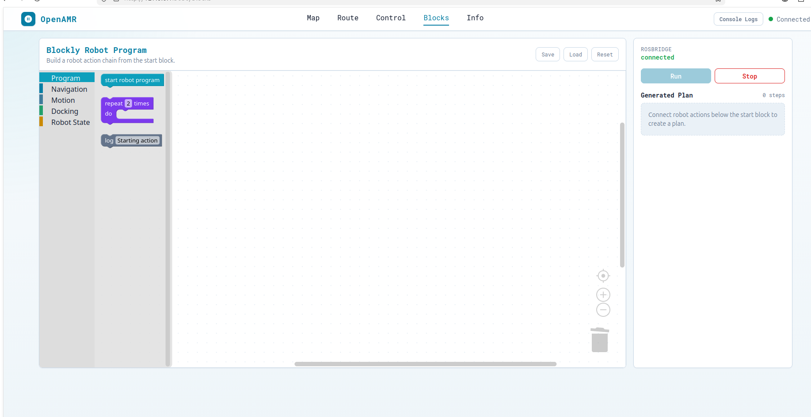

Program blocks control the shape of your Blockly program. They do not directly
move the robot unless robot action blocks are connected below or inside them.

#### `start robot program`

This is the entry point. The planner looks for a top-level `start robot program`
block and converts the blocks connected below it into the Generated Plan.

Use one start block for real robot runs. Multiple start blocks can confuse the
Generated Plan because the planner reads one top-level start block.

Good example:

```text
start robot program
  wait 1 seconds
  log "Program started"
```

What happens:

- The program starts.
- It waits one second.
- It logs the message.

Common mistake:

```text
start robot program

drive linear speed 0.1 for 2 seconds
```

The drive block is loose, so it will not run. Connect it below the start block.

#### `repeat N times`

This repeats the blocks placed inside its `do` area. It is useful for repeated
tests, patrol patterns, or repeated motion.

Example:

```text
start robot program
  repeat 3 times
    drive linear speed 0.05 for 1 seconds
    rotate angular speed 0.3 for 1 seconds
```

What happens:

- The robot drives slowly for one second.
- The robot rotates for one second.
- The same two actions repeat three times.

Use small speeds when testing a repeat block. A mistake inside a repeat block is
also repeated.

#### `log "message"`

This writes a debug message to the browser console and publishes the same text
on the UI message topic. It is useful for understanding where a program is.

Example:

```text
start robot program
  log "Going to charging station"
  navigate to location Charging Station
  wait until navigation complete timeout 60 seconds
  log "Navigation finished"
```

What happens:

- The first log appears before navigation starts.
- The robot receives the named navigation goal.
- The program waits for navigation status.
- The second log appears after navigation finishes.

### Navigation Blocks

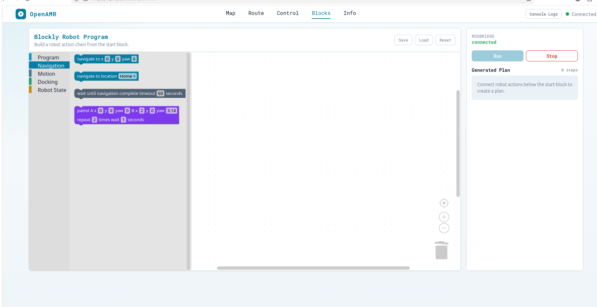

Navigation blocks publish map-frame goals or wait for Nav2-style navigation
status. They are best used when the robot is localized and the map is correct.

#### `navigate to x X y Y yaw YAW`

This sends a goal pose in the map frame. `x` and `y` are position in meters.
`yaw` is heading in radians.

Example:

```text
start robot program
  navigate to x 1.5 y 0 yaw 0
  wait until navigation complete timeout 60 seconds
```

What happens:

- A goal pose is published to `/goal_pose`.
- The robot navigation stack should start moving toward that pose.
- The wait block pauses the program until navigation succeeds, fails, is
  canceled, or times out.

Useful yaw values:

```text
yaw 0      = face forward
yaw 1.57   = face left 90 degrees
yaw -1.57  = face right 90 degrees
yaw 3.14   = face backward
```

Important: the `navigate` block publishes the goal and continues immediately.
Add `wait until navigation complete` after it when the next step should wait for
arrival.

#### `navigate to location NAME`

This sends a saved named location. The current options come from the backend
Named Locations list, with default fallback values from `blockDefinitions.js`:

```text
Home
Charging Station
Pickup Point
Dropoff Point
```

Example:

```text
start robot program
  navigate to location Home
  wait until navigation complete timeout 60 seconds
```

What happens:

- The selected location is converted into its saved `x`, `y`, and `yaw`.
- A goal pose is published.
- The program waits for navigation to finish.

Before using named locations on a real robot, save coordinates that match your
map in the `Named Locations` panel.

#### `wait until navigation complete timeout N seconds`

This waits for `/ui/navigate_to_pose/status`. It finishes successfully when the
latest navigation status is `Succeeded`. It fails if navigation is canceled,
fails, or does not finish before the timeout.

Example:

```text
start robot program
  navigate to x 2 y 1 yaw 1.57
  wait until navigation complete timeout 90 seconds
  log "Reached point"
```

What happens:

- The robot receives the goal.
- The program waits up to 90 seconds.
- If navigation succeeds, the log block runs.
- If navigation fails or times out, the program reports an error.

Use a longer timeout for far goals or slow robots.

#### `patrol A x ... y ... yaw ... B x ... y ... yaw ... repeat N times wait S seconds`

This is a shortcut for moving between two map points. Internally it creates a
repeat action containing:

```text
navigate to A
wait until navigation complete timeout 60 seconds
wait S seconds
navigate to B
wait until navigation complete timeout 60 seconds
wait S seconds
```

Example:

```text
start robot program
  patrol A x 0 y 0 yaw 0 B x 2 y 0 yaw 3.14
  repeat 3 times wait 1 seconds
```

What happens:

- The robot goes to point A.
- It waits for navigation completion.
- It pauses for one second.
- It goes to point B.
- It waits again.
- The A-to-B cycle repeats three times.

Use patrol only when both points are reachable on the current map.

### Motion Blocks

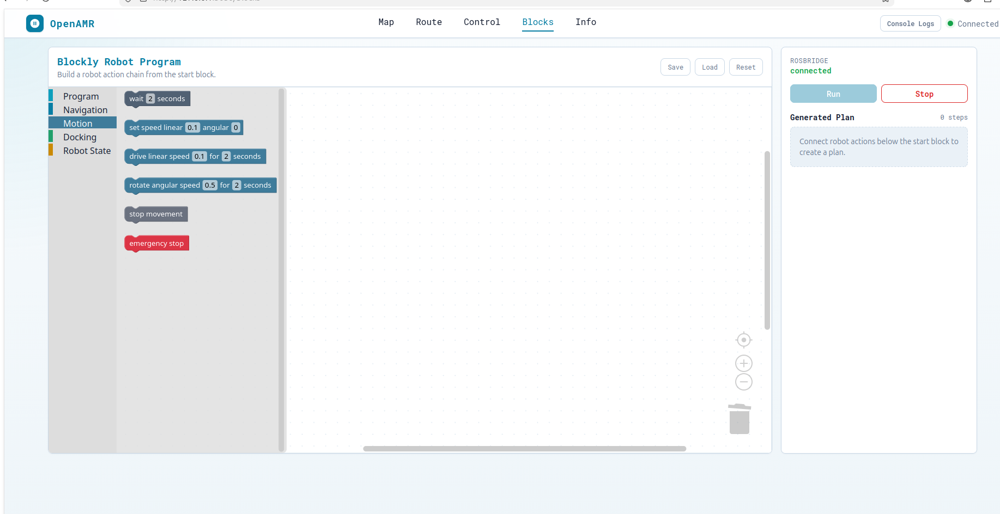

Motion blocks publish direct velocity commands or wait for time. These do not
plan around obstacles. Use them carefully on a real robot.

#### `wait N seconds`

This pauses the program for the selected number of seconds.

Example:

```text
start robot program
  log "Waiting before movement"
  wait 2 seconds
  drive linear speed 0.05 for 1 seconds
```

What happens:

- The log message runs.
- The program waits two seconds.
- The robot drives slowly for one second.

#### `set speed linear L angular A`

This publishes a velocity command to `/cmd_vel` and immediately continues to the
next block. It does not stop by itself.

Example:

```text
start robot program
  set speed linear 0.1 angular 0
  wait 2 seconds
  stop movement
```

What happens:

- The robot receives forward velocity.
- The program waits two seconds while the robot keeps moving.
- `stop movement` publishes zero velocity.

Safe rule: always follow `set speed` with `wait` and then `stop movement` unless
you intentionally want another block to change or stop the velocity.

#### `drive linear speed L for N seconds`

This drives forward or backward for a fixed time, then automatically publishes
zero velocity.

Example:

```text
start robot program
  drive linear speed 0.05 for 1 seconds
```

What happens:

- The robot drives forward at `0.05 m/s`.
- After one second, the block sends zero velocity.

Use negative linear speed to drive backward:

```text
start robot program
  drive linear speed -0.05 for 1 seconds
```

#### `rotate angular speed A for N seconds`

This rotates in place for a fixed time, then automatically publishes zero
velocity.

Example:

```text
start robot program
  rotate angular speed 0.3 for 1 seconds
```

What happens:

- The robot rotates at `0.3 rad/s`.
- After one second, the block sends zero velocity.

Use a negative angular speed to rotate the other direction:

```text
start robot program
  rotate angular speed -0.3 for 1 seconds
```

#### `stop movement`

This publishes zero velocity to `/cmd_vel`. It does not cancel a navigation goal.

Example:

```text
start robot program
  set speed linear 0.1 angular 0
  wait 1 seconds
  stop movement
```

Use this after direct motion commands when you only want to stop velocity.

#### `emergency stop`

This publishes zero velocity and calls the navigation cancel service. Use it
when you need to stop direct motion and cancel active navigation.

Example:

```text
start robot program
  navigate to x 2 y 0 yaw 0
  wait 1 seconds
  emergency stop
```

What happens:

- The robot receives a navigation goal.
- The program waits one second.
- The emergency stop block sends zero velocity and cancels navigation.

On a real robot, this UI command is not a replacement for a physical emergency
stop.

### Docking Blocks

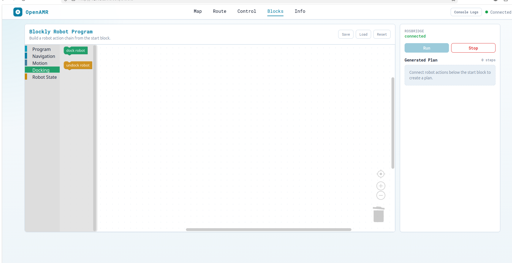

Docking blocks publish trigger messages. The robot stack must provide the real
docking and undocking behavior.

#### `dock robot`

This publishes `true` to `/dock_trigger`.

Example:

```text
start robot program
  navigate to location Charging Station
  wait until navigation complete timeout 60 seconds
  dock robot
```

What happens:

- The robot navigates near the charging station.
- The program waits for navigation to finish.
- The dock trigger is published.

Make sure the robot is close enough and correctly oriented for your docking
system before triggering docking.

#### `undock robot`

This publishes `true` to `/undock_robot`.

Example:

```text
start robot program
  undock robot
  wait 2 seconds
  drive linear speed 0.05 for 2 seconds
```

What happens:

- The undock trigger is published.
- The program waits two seconds.
- The robot moves slowly away.

Use a small speed and short time until the undocking behavior is verified.

### Robot State Blocks

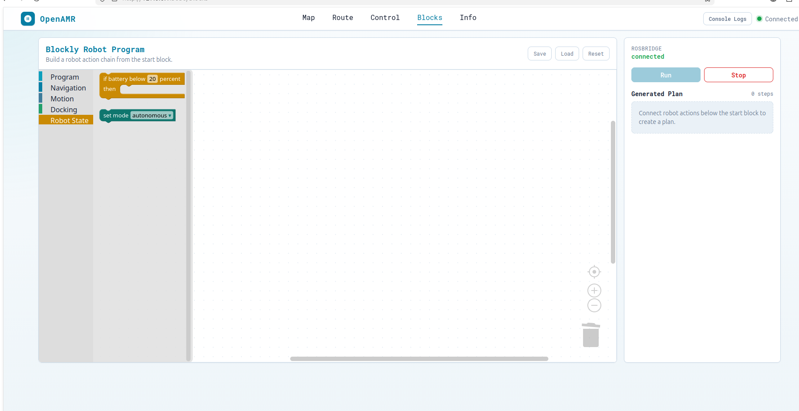

Robot State blocks use robot state or publish a selected mode command.

#### `if battery below N percent then ...`

This reads one message from `/battery_status`. If the value is below the chosen
percentage, the blocks inside the `then` area run. If no battery message is
received, the nested blocks are skipped.

Example:

```text
start robot program
  if battery below 20 percent
    log "Battery low, going to dock"
    navigate to location Charging Station
    wait until navigation complete timeout 60 seconds
    dock robot
```

What happens:

- The UI waits briefly for battery percentage.
- If battery is below 20, the nested docking sequence runs.
- If battery is 20 or higher, nothing inside the condition runs.
- If no battery value is received, the condition is skipped.

This block requires a numeric battery percentage topic.

#### `set mode autonomous/manual/idle`

This publishes the selected mode string to `/ui_operation`.

Example:

```text
start robot program
  set mode autonomous
  navigate to x 1 y 0 yaw 0
  wait until navigation complete timeout 60 seconds
```

What happens:

- The selected mode is published.
- The navigation goal is sent.
- The program waits for navigation to finish.

Use this block only if your ROS-side system listens for these mode strings on
`/ui_operation`.

## How To Execute A Blockly Program Properly

Use this checklist every time, especially on a real robot.

1. Start the robot or simulation stack first.
2. Start the OpenAMR UI launch in a separate terminal:

```bash
cd ~/openamrobot-ui/ros2
source /opt/ros/jazzy/setup.bash
source install/setup.bash
ros2 launch openamr_ui_package new_ui_launch.py
```

If your workspace uses the bringup wrapper instead, this is also valid:

```bash
cd ~/openamrobot-ui/ros2
source /opt/ros/jazzy/setup.bash
source install/setup.bash
ros2 launch openamr_ui_bringup ui.launch.py
```

3. Open the Blockly page:

```text
http://127.0.0.1:5050/blocks
```

4. Confirm the right panel says:

```text
ROSBRIDGE connected
```

5. Keep one `start robot program` block in the workspace.
6. Connect every action you want to run below that start block.
7. Check the `Generated Plan` panel. It should list the actions you expect.
8. For navigation programs, confirm the robot is localized and the map is
   correct.
9. For direct motion programs, use small speeds first:

```text
linear 0.05
angular 0.3
```

10. Press `Run`.
11. Watch the robot and the Generated Plan while it runs.
12. Press `Stop` if the robot should stop immediately.

The `Run` button is disabled when ROSBridge is disconnected, when there are no
generated steps, or when a program is already running.

If the plan contains direct motion, docking, undocking, emergency stop, or
validation warnings, the page asks for confirmation before running. Confirm only
after checking that the robot area is clear.

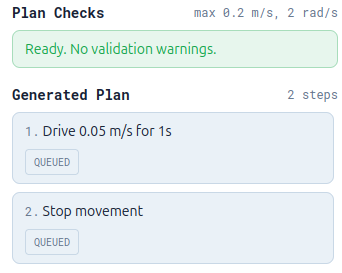

The `Stop` button calls the same emergency stop behavior used by the
`emergency stop` block: it publishes zero velocity and cancels navigation.

### Safest First Real-Robot Test

Use this tiny program before trying navigation, docking, or patrol:

```text
start robot program
  drive linear speed 0.05 for 1 seconds
```

Expected result:

- Generated Plan shows one drive step.
- The robot moves forward slowly for one second.
- The robot stops automatically.

If this does not work, do not test larger programs yet. Check ROSBridge,
`/cmd_vel`, robot motor enable state, and the robot/simulation bringup.

## Important Values

### Navigation Coordinates

`x` and `y` are map coordinates in meters.

`yaw` is the robot heading in radians:

```text
yaw 0      = face forward
yaw 1.57   = turn left 90 degrees
yaw -1.57  = turn right 90 degrees
yaw 3.14   = face backward
```

### Velocity Values

Direct motion uses `/cmd_vel`.

```text
linear 0.1 angular 0    = move forward slowly
linear -0.1 angular 0   = move backward slowly
linear 0 angular 0.5    = rotate left
linear 0 angular -0.5   = rotate right
```

Start with small values:

```text
linear 0.05
angular 0.3
```

## Named Locations

Named locations are loaded from the Flask backend when the Blocks page opens.
The `navigate to location` dropdown uses the backend list, with built-in default
locations as a fallback.

The `Named Locations` panel in the right sidebar lets you manage locations:

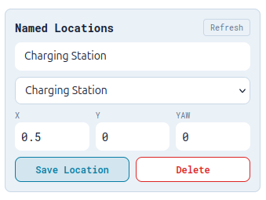

| Control       | Meaning                                               |
| ------------- | ----------------------------------------------------- |
| Location name | Name shown in the `navigate to location` block        |
| Location list | Existing backend locations                            |
| `x`           | Map x coordinate in meters                            |
| `y`           | Map y coordinate in meters                            |
| `yaw`         | Robot heading in radians                              |
| Save Location | Saves or overwrites the location on the backend       |
| Delete        | Deletes the selected backend location                 |
| Refresh       | Reloads backend locations and updates generated plans |

Backend locations are stored here:

```text
~/.openamr_ui/block_locations.json
```

Backend API endpoints:

| Endpoint                      | Method   | Use                  |
| ----------------------------- | -------- | -------------------- |
| `/api/block-locations`        | `GET`    | List named locations |
| `/api/block-locations/<name>` | `POST`   | Save or overwrite    |
| `/api/block-locations/<name>` | `DELETE` | Delete one location  |

Default fallback locations are defined in `blockDefinitions.js`:

```js
export const DEFAULT_OPEN_AMR_LOCATIONS = {
  Home: { x: 0, y: 0, yaw: 0 },
  "Charging Station": { x: 0.5, y: 0, yaw: 0 },
  "Pickup Point": { x: 2, y: 1, yaw: 1.57 },
  "Dropoff Point": { x: 0, y: 2, yaw: 3.14 },
};
```

If a saved program references a named location that no longer exists, the
Blocks page shows a Plan Checks error and disables Run until the location is
restored or the block is changed.

For normal use, update locations in the `Named Locations` panel so they are
stored on the backend. Edit `DEFAULT_OPEN_AMR_LOCATIONS` only if you want to
change the built-in fallback values; after editing source code, rebuild and
restart the UI using the production update flow above.

## Example Programs

### 1. Safest First Movement Test

Use this when testing on a real robot for the first time:

```text
start robot program
  drive linear speed 0.05 for 1 seconds
  stop movement
```

What it does:

- Moves forward slowly for one second.
- Publishes zero velocity.
- Does not send a navigation goal.

### 2. Turn In Place

```text
start robot program
  rotate angular speed 0.5 for 2 seconds
  stop movement
```

Use `-0.5` to rotate the other direction.

### 3. Navigate And Wait

```text
start robot program
  navigate to x 1.5 y 0 yaw 0
  wait until navigation complete timeout 60 seconds
  wait 2 seconds
```

This is better than only using `navigate`, because the next block waits until
navigation finishes.

### 4. Navigate To Charging Station And Dock

```text
start robot program
  navigate to location Charging Station
  wait until navigation complete timeout 60 seconds
  dock robot
```

Before using this on a real robot, confirm the charging station coordinates are
correct in the backend `Named Locations` panel.

### 5. Undock And Move Away

```text
start robot program
  undock robot
  wait 2 seconds
  drive linear speed 0.1 for 2 seconds
  stop movement
```

This starts undocking, waits briefly, then moves away from the dock.

### 6. Repeat A Small Pattern

```text
start robot program
  repeat 3 times
    drive linear speed 0.1 for 1 seconds
    rotate angular speed 0.5 for 1 seconds
```

This drives and turns three times.

### 7. Patrol Between Two Points

```text
start robot program
  patrol A x 0 y 0 yaw 0 B x 2 y 0 yaw 3.14
  repeat 3 times wait 1 seconds
```

This moves from point A to point B, waits, then repeats.

Internally, the patrol block sends A, waits for navigation to complete, waits
the selected pause time, sends B, waits for navigation to complete, and pauses
again.

### 8. Battery-Based Docking

```text
start robot program
  if battery below 20 percent
    navigate to location Charging Station
    wait until navigation complete timeout 60 seconds
    dock robot
```

This only runs the nested actions if the battery topic reports below 20 percent.
If the UI does not receive a battery value, it skips the nested actions.

### 9. Debug A Program With Logs

```text
start robot program
  log "Starting patrol"
  patrol A x 0 y 0 yaw 0 B x 1 y 1 yaw 1.57
  repeat 2 times wait 1 seconds
  log "Patrol complete"
```

Logs help you understand which part of a program is running.

### 10. Mode Then Navigation

```text
start robot program
  set mode autonomous
  navigate to x 1 y 0 yaw 0
  wait until navigation complete timeout 60 seconds
```

Use this only if the ROS side listens to the UI operation topic.

## Adding A New Block

Adding a block usually requires three edits.

### 1. Define The Block

Edit:

```text
web/src/features/blocks/blockDefinitions.js
```

Add a JSON block definition:

```js
{
  type: "openamr_beep",
  message0: "beep robot",
  previousStatement: null,
  nextStatement: null,
  colour: "#8b5cf6",
  tooltip: "Trigger a robot beep.",
}
```

Then convert it into an action in `blockToAction`:

```js
case "openamr_beep":
  return { type: "beep" };
```

### 2. Add It To The Toolbox

Edit:

```text
web/src/features/blocks/toolbox.js
```

Add:

```js
{ kind: "block", type: "openamr_beep" }
```

### 3. Execute The Action

Edit:

```text
web/src/features/blocks/robotActions.js
```

Add a case:

```js
case "beep":
  // Publish to your beep topic here.
  return;
```

Then rebuild the frontend and ROS package.

## ROS Topics Used By Blockly

The block executor uses topics and services configured in:

```text
web/src/shared/constants/index.js
```

Common topics:

| Topic or Service                        | Used For                         |
| --------------------------------------- | -------------------------------- |
| `/goal_pose`                            | Navigation goal pose             |
| `/cmd_vel`                              | Direct velocity commands         |
| `/dock_trigger`                         | Dock trigger                     |
| `/undock_robot`                         | Undock trigger                   |
| `/ui/navigate_to_pose/status`           | Navigation completion status     |
| `/battery_status`                       | Battery percentage               |
| `/ui_operation`                         | UI mode command                  |
| `/ui_message`                           | Log/debug message                |
| `/navigate_to_pose/_action/cancel_goal` | Emergency stop navigation cancel |

If your robot uses different topic names, update `AppConfig` in
`web/src/shared/constants/index.js` or update the topics in `robotActions.js`.

Note: `/dock_trigger`, `/undock_robot`, and
`/navigate_to_pose/_action/cancel_goal` are currently hardcoded in
`robotActions.js`.

## Program Templates

The `Program Templates` panel in the right sidebar loads ready-made Blockly
programs into the workspace. Templates are useful for first-time users, demos,
and quick robot checks.

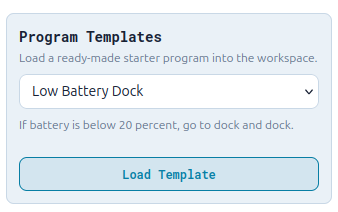

Loading a template clears the current workspace and replaces it with the
selected example. Save your current program first if you want to keep it.

Available templates:

| Template          | What It Builds                                                    | Best Use                        |
| ----------------- | ----------------------------------------------------------------- | ------------------------------- |
| Safe Motion Test  | Drives forward at `0.05 m/s` for one second, then stops           | First real-robot motion check   |
| Navigate And Wait | Sends one `x`, `y`, `yaw` goal and waits for navigation to finish | Basic navigation test           |
| Docking Sequence  | Navigates to `Charging Station`, waits, then runs `dock robot`    | Docking workflow test           |
| Patrol Route      | Uses the patrol block to move between two points twice            | Repeated navigation demo        |
| Low Battery Dock  | If battery is below 20%, logs a message, navigates to dock, docks | Conditional robot-state example |

Recommended beginner flow:

1. Load `Safe Motion Test`.
2. Check `Generated Plan`.
3. Confirm `Plan Checks` has no errors.
4. Press `Run` only after ROSBridge is connected and the robot area is clear.
5. Save the edited program through `Backend Programs` if you want to reuse it.

Templates are defined in:

```text
web/src/features/blocks/programTemplates.js
```

To add a new template, add one item to `programTemplates` with a unique `id`, a
display `name`, a short `description`, and a `createWorkspace` function that
returns Blockly workspace JSON.

## Voice Command

The `Voice Command` panel lets you speak a command instead of dragging
blocks. The browser captures your speech, sends the transcript to the Flask
backend, which calls the Claude API to translate it into a robot action plan.
The UI then converts that plan into real Blockly blocks in the workspace so
you can review them before running.

You must say the wake word "Monsieur" before your command (see
[Wake Word](#wake-word)); speech before it is ignored.

Flow:

```text
You speak
  -> browser Web Speech API transcript
  -> strip everything up to and including "Monsieur"
  -> POST /api/voice-plan (Flask backend)
  -> Claude API (claude-sonnet-5) returns a structured action plan
  -> planToWorkspace() builds Blockly JSON
  -> Blockly.serialization.workspaces.load() populates the workspace
  -> Generated Plan and Plan Checks update automatically
  -> you review, then press Run
```

Voice input only builds and displays blocks. It never runs a program by
itself; you still press `Run`, and any risky-action confirmation dialog still
appears exactly as it does for a manually built or template-loaded program.

### Voice Command Requirements

- Chrome or Edge. The Web Speech API used for microphone capture is not
  supported in Firefox.
- A secure context: `http://localhost:5050` / `http://127.0.0.1:5050`, or
  HTTPS. Browsers block microphone access on plain HTTP LAN addresses such as
  `http://192.168.x.x:5050` — the permission control shows up greyed out and
  stuck on `Block` in the browser's site settings, and it cannot be changed
  from there. Either open the UI from the same machine using `localhost`, or
  put HTTPS in front of Flask before using voice input from a tablet or a
  second computer.
- An Anthropic API key (`ANTHROPIC_API_KEY`) set in the environment of the
  process that launches the UI. Get a key from
  [console.anthropic.com](https://console.anthropic.com) under
  **Settings -> API Keys**. Billing must be enabled on the account; API
  usage is billed separately from a claude.ai subscription.

Easiest setup: copy `ros2/src/openamr_ui_package/.env.example` to `.env` in
that same directory and fill in `ANTHROPIC_API_KEY` there. It's gitignored,
and `new_ui_launch.py` loads it and injects it only into the `flask_app`
node's process — no shell `export` needed. See
[launch/README.md](../../../../ros2/src/openamr_ui_package/launch/README.md).

Alternatively, export the key in the terminal before launching:

```bash
export ANTHROPIC_API_KEY="sk-ant-your-key-here"
cd ~/openamrobot-ui
source /opt/ros/jazzy/setup.bash
source ros2/install/setup.bash
bash scripts/run_ui_backend.sh
```

If the key is missing, the panel shows a toast: `ANTHROPIC_API_KEY is not set
on the server.` If the browser cannot use speech recognition at all, the
panel shows: `Voice input isn't supported in this browser.`

### How To Use Voice Command

1. Open the Blocks page from a supported browser/origin (see requirements
   above).
2. In the right panel, find `Voice Command`.
3. Press `Tap to speak a command`. Allow the microphone permission prompt the
   first time.
4. Say "Monsieur" followed by one sentence describing the program, e.g.
   "Monsieur, navigate to x 1 y 1 yaw 0, then wait 3 seconds, then dock".
   Listening stops automatically at the end of the sentence.
5. The panel shows `Generating plan...` while it calls the backend.
6. When it finishes, the workspace is replaced with generated blocks matching
   the sentence, and a toast reports how many steps were generated.
7. Check the `Generated Plan` and `Plan Checks` panels exactly as you would
   for any other program.
8. Press `Run` only after confirming the blocks and plan are correct.

Generating a new voice plan replaces the current workspace. Save your current
program first (`Backend Programs` or the toolbar `Save`/`Export`) if you want
to keep it.

### Wake Word

You must say the wake word "Monsieur" before your command, e.g.:

> "Monsieur, navigate to x 1 y 1 yaw 0, then wait 3 seconds, then dock"

The transcript box stays empty while you're speaking until "Monsieur" is
heard — only the text after it is shown and sent to `/api/voice-plan`. The
panel strips the wake word itself (and a trailing comma/colon, if any) before
sending the command.

Notes:

- The wake word match is case-insensitive and does not need to be the first
  word — "hey Monsieur, dock" also works — but it does need the browser's
  speech recognizer to actually transcribe the word "Monsieur" correctly.
- If you finish speaking without saying "Monsieur" at all, a toast reports
  that the wake word wasn't heard and no plan is generated. If you say
  "Monsieur" but nothing after it, a toast asks you to try again.
- Listening stops automatically after one sentence, same as before — there is
  no continuous/always-listening mode.

### Example Voice Commands

Say "Monsieur" before each of these (omitted from the table below for
brevity), e.g. "Monsieur, navigate to x 1 y 1 yaw 0, then wait 3 seconds,
then dock".

| What You Say                                                            | What Gets Built                                                                                                   |
| ------------------------------------------------------------------------ | ------------------------------------------------------------------------------------------------------------------ |
| "Navigate to x 1 y 1 yaw 0, then wait 3 seconds, then dock"              | `navigate to x 1 y 1 yaw 0`, `wait 3 seconds`, `dock robot`                                                       |
| "Go to the charging station and dock"                                   | `navigate to location Charging Station`, `dock robot` (uses the saved named location)                             |
| "Drive forward slowly for 2 seconds then stop"                          | `drive linear speed 0.1 for 2 seconds`, `stop movement`                                                           |
| "Rotate in place for 2 seconds, then wait 1 second"                     | `rotate angular speed ... for 2 seconds`, `wait 1 seconds`                                                        |
| "Undock, wait 2 seconds, then drive away for 2 seconds"                 | `undock robot`, `wait 2 seconds`, `drive linear speed ... for 2 seconds`                                          |
| "Repeat 3 times: log starting loop, then wait 1 second"                | `repeat 3 times` containing `log "starting loop"` and `wait 1 seconds`                                            |
| "If battery is below 20 percent, go to the charging station and dock"   | `if battery below 20 percent` containing `navigate to location Charging Station` and `dock robot`                 |
| "Set mode to autonomous, then navigate to x 2 y 0 yaw 0"                | `set mode autonomous`, `navigate to x 2 y 0 yaw 0`                                                                 |
| "Emergency stop"                                                        | `emergency stop`                                                                                                   |
| "Patrol between the pickup point and the dropoff point, repeat 3 times, wait 5 seconds between each" | `patrol` block with the two named locations, `repeat` set to `3`, `wait` set to `5 seconds`         |
| "Navigate to the pickup point, wait until navigation is complete with a 60 second timeout, then log arrived" | `navigate to location Pickup Point`, `wait until navigation complete timeout 60 seconds`, `log "arrived"` |
| "Log starting delivery, navigate to x 1.5 y 0 yaw 0, wait 2 seconds, undock, then emergency stop" | `log "starting delivery"`, `navigate to x 1.5 y 0 yaw 0`, `wait 2 seconds`, `undock robot`, `emergency stop` |

Things Voice Command will **not** do: change robot firmware/config, answer
general questions unrelated to building a program, or run the program for
you. Say what the robot should do as a sequence of actions ("go here, wait,
then dock") rather than asking a question ("why is the battery low?") — a
question with no buildable action typically comes back as an empty or
near-empty plan.

Claude only uses the action types already defined for the Blockly blocks (see
[Current Block Categories](#current-block-categories)); it cannot invent a new
kind of action. Named-location commands only resolve correctly when that name
already exists in the `Named Locations` panel — otherwise Plan Checks reports
a missing-location error and disables `Run`, the same as it would for a
manually built program.

Speak clearly and keep commands to one program per phrase. Complex,
multi-clause sentences are more likely to be misinterpreted; if the generated
blocks look wrong, try a simpler phrasing, or edit the generated blocks by
hand afterward.

### Voice Command Backend Endpoint

| Endpoint          | Method | Use                                                                    |
| ------------------ | ------ | ----------------------------------------------------------------------- |
| `/api/voice-plan`  | `POST` | Body `{ transcript, locations }`; returns `{ plan, transcript }`       |

The endpoint is implemented in
`ros2/src/openamr_ui_package/openamr_ui_package/flask_app.py`. It reads
`ANTHROPIC_API_KEY` from the process environment, calls the Anthropic
Messages API with a forced tool call constrained to the block action schema,
sanitizes the returned actions (unknown action types are dropped, recursively,
including inside `repeat`/`battery_below`), and returns the plan. No new
Python dependency was added; the call uses the standard library
`urllib.request`.

## Run History

The `Run History` panel records the result of each block program run. It helps
you debug what happened after pressing `Run`.

Each entry stores:

- program or template name
- run status: `success`, `failed`, or `stopped`
- start and finish time
- duration
- completed steps and total steps
- error message, if the run failed

The panel shows the latest five entries. Use `Refresh` to reload history from
the backend and `Clear` to delete the stored history.

Run history is stored here:

```text
~/.openamr_ui/block_run_history.json
```

Backend API endpoints:

| Endpoint                 | Method   | Use                     |
| ------------------------ | -------- | ----------------------- |
| `/api/block-run-history` | `GET`    | List recent run history |
| `/api/block-run-history` | `POST`   | Save one run result     |
| `/api/block-run-history` | `DELETE` | Clear run history       |

Run History is not a replacement for ROS logs. Use it as a quick UI-level
summary, then check ROS logs for deeper robot-side failures.

## Save, Load, Delete, And Reset

The Blockly page supports two kinds of storage:

1. Backend saved programs, stored by the Flask UI server.
2. Browser local storage, stored only in the current browser.

Use backend saved programs for normal work. Use browser local storage as a
quick temporary backup while editing.

### Backend Saved Programs

The `Backend Programs` panel is in the right sidebar on the Blocks page.

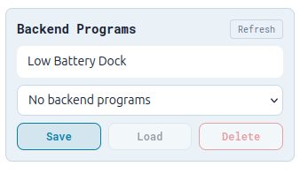

| Control        | Meaning                                                       |
| -------------- | ------------------------------------------------------------- |
| Program name   | Name used when saving the current Blockly workspace           |
| Saved dropdown | Existing backend programs found on the Flask server           |
| Refresh        | Reloads the saved-program list from the backend               |
| Save           | Saves the current workspace and generated plan to the backend |
| Load           | Loads the selected backend program into the Blockly workspace |
| Delete         | Deletes the selected backend program from the backend         |

Backend programs are stored as JSON files here:

```text
~/.openamr_ui/block_programs/
```

Each saved file contains:

- the program name
- the save timestamp
- the Blockly workspace JSON
- the generated plan preview

Program names may contain letters, numbers, spaces, dots, underscores, and
hyphens. Names must be 1 to 64 characters long.

Backend API endpoints:

| Endpoint                     | Method   | Use                 |
| ---------------------------- | -------- | ------------------- |
| `/api/block-programs`        | `GET`    | List saved programs |
| `/api/block-programs/<name>` | `GET`    | Load one program    |
| `/api/block-programs/<name>` | `POST`   | Save or overwrite   |
| `/api/block-programs/<name>` | `DELETE` | Delete one program  |

When running the React development server at `http://localhost:3000/blocks`,
the frontend calls the Flask backend at `http://127.0.0.1:5050`. Start the ROS
UI launch first if you want backend Save/Load/Delete to work in development.

### Browser Save, Load, Import, Export, And Reset

The top-right `Save` and `Load` buttons use browser local storage:

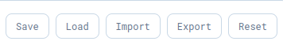

```text
openamr_blockly_workspace
```

Top-right buttons:

| Button | Meaning                                                   |
| ------ | --------------------------------------------------------- |
| Save   | Saves the current blocks in this browser                  |
| Load   | Loads the saved blocks                                    |
| Import | Loads a Blockly workspace from a `.json` file             |
| Export | Downloads the current Blockly workspace as a `.json` file |
| Reset  | Clears the workspace and loads the default program        |

Browser local storage is tied to one browser and one host. A workspace saved in
one browser may not appear in another browser.

Use `Export` and `Import` when you want to move a program between machines,
share an example, or attach a reproducible program to an issue or pull request.

If the UI behaves strangely after block changes, press `Reset` or clear browser
site data for `127.0.0.1:5050`.

## Troubleshooting

### I Only See Program And Robot Categories

You are seeing the old bundle. The new toolbox should show:

```text
Program
Navigation
Motion
Docking
Robot State
```

Fix:

```bash
cd ~/openamrobot-ui
bash scripts/build_frontend.sh
bash scripts/sync_frontend_to_ros.sh
cd ros2
colcon build --packages-select openamr_ui_package
source install/setup.bash
ros2 launch openamr_ui_package new_ui_launch.py
```

Then hard refresh the browser:

```text
Ctrl+Shift+R
```

If it still shows the old categories, remove the stale installed app bundle and
rebuild:

```bash
cd ~/openamrobot-ui
rm -rf ros2/install/openamr_ui_package/share/openamr_ui_package/app
cd ros2
colcon build --packages-select openamr_ui_package
source install/setup.bash
```

### npm run build Says package.json Is Missing

You are probably in the wrong folder.

Wrong:

```bash
cd ~/openamrobot-ui/ros2
npm run build
```

Correct:

```bash
cd ~/openamrobot-ui/web
npm run build
```

### ROSBridge Says Disconnected

The browser can render the page, but it cannot command the robot until ROSBridge
is connected.

Check:

- The UI launch is running.
- `rosbridge_websocket` is running on port `9090`.
- The robot or simulation workspace is running.
- The browser is opened from the correct host.

### Run Button Is Disabled

The `Run` button is disabled on purpose when the UI cannot safely execute a
program.

Check:

- ROSBridge status says `connected`.
- The Generated Plan has at least one step.
- A program is not already running.
- Blocks are connected below `start robot program`.

If ROSBridge is disconnected, start or restart the UI launch and confirm
`rosbridge_websocket` is running. If the Generated Plan has `0 steps`, check the
next troubleshooting section.

### Generated Plan Shows 0 Steps

The UI only runs actions connected below the start block that the planner reads.

Fix:

- Keep only one `start robot program` block in the workspace.
- Connect action blocks directly below that start block.
- Remove loose duplicate start blocks.
- Press `Reset` if the workspace is confusing.
- Build a tiny test program:

```text
start robot program
  wait 1 seconds
```

If that creates one Generated Plan step, the planner is working.

### Saved Blocks Look Wrong

The top toolbar `Save` button stores one workspace in browser local storage. If
old blocks keep returning, the browser may be loading that saved workspace.
Backend saved programs are separate and load only when you use the `Backend
Programs` panel.

Fix:

- Press `Reset` on the Blockly page.
- Save again after building the correct program.
- Clear site data for `127.0.0.1:5050` if needed.

Resetting the workspace does not change the source code. It only changes the
blocks saved in that browser.

### Navigation Does Not Continue

If a program waits forever or times out after navigation, check:

- Nav2 is running.
- The goal is reachable.
- `/ui/navigate_to_pose/status` is being published.
- The timeout value is large enough.

### Robot Moves Too Fast

Use smaller values:

```text
drive linear speed 0.05 for 1 seconds
rotate angular speed 0.3 for 1 seconds
```

Always test direct velocity commands in an open area.

### Robot Does Not Move

If the program runs but the robot does not move, check:

- ROSBridge is connected.
- The robot or simulation stack is running.
- `/cmd_vel` reaches the robot controller.
- Motors or simulation control are enabled.
- No physical or software emergency stop is active.
- For navigation, Nav2 is active and the robot is localized.

Start with the safest test:

```text
start robot program
  drive linear speed 0.05 for 1 seconds
```

Do not test larger motion or patrol programs until this basic command works.

### Voice Command Doesn't Work

Check these in order:

1. **"Voice input isn't supported in this browser"** — use Chrome or Edge.
   Firefox does not implement the Web Speech API used here.
2. **Microphone permission is stuck on `Block` and greyed out in browser site
   settings** — you are on an insecure origin, such as
   `http://192.168.x.x:5050`. Open the UI at `http://localhost:5050` (same
   machine) instead, or put HTTPS in front of Flask for LAN/tablet access.
3. **Toast says `ANTHROPIC_API_KEY is not set on the server`** — export the
   key in the terminal that launches the UI, then restart the launch:

```bash
export ANTHROPIC_API_KEY="sk-ant-your-key-here"
cd ~/openamrobot-ui
source /opt/ros/jazzy/setup.bash
source ros2/install/setup.bash
bash scripts/run_ui_backend.sh
```

4. **Toast reports a Claude API error** — confirm `ANTHROPIC_API_KEY` is valid
   and the account has billing enabled; check the terminal running the
   Flask/ROS node for the full error detail.
5. **Generated blocks don't match what you said** — try a shorter, simpler
   sentence, one program per phrase. You can always edit the generated
   blocks by hand afterward.
6. **Toast says the wake word wasn't heard, even though you said
   "Monsieur"** — the recognizer likely misheard it as something else (e.g.
   "monsewer"). Speak it more clearly and pause briefly after it, then try
   again.

### Category Images Do Not Appear In The README

The category screenshots are stored in:

```text
docs/assets/completeuiimage.png
docs/assets/saveloadimport.png
docs/assets/program.png
docs/assets/navigation.png
docs/assets/motion.png
docs/assets/docking.png
docs/assets/robotstate.png
docs/assets/programtemplate.png
docs/assets/backendprogram.png
docs/assets/namedlocations.png
docs/assets/planchecksandgeneratedplan.png
```

If they do not render in a Markdown viewer, confirm those files exist and that
you are viewing the README from the repository root or a viewer that supports
relative image paths.

## Safety Notes

- Test first in simulation when possible.
- Start with very small linear and angular speeds.
- Keep a physical emergency stop available on a real robot.
- Use `stop movement` after direct speed commands.
- Use `emergency stop` when you need to cancel active navigation too.
- Confirm map coordinates before running navigation or docking programs.
- Voice-generated plans go through the same Plan Checks and risky-action
  confirmation as manually built programs. Always review the Generated Plan
  before pressing Run, whether the blocks came from dragging, a template, or
  voice.

## Quick Command Cheat Sheet

Frontend development:

```bash
cd ~/openamrobot-ui/web
npm install
npm run dev
```

Production frontend build:

```bash
cd ~/openamrobot-ui/web
npm run build
```

Sync frontend into ROS package:

```bash
cd ~/openamrobot-ui
bash scripts/sync_frontend_to_ros.sh
```

Build ROS package:

```bash
cd ~/openamrobot-ui/ros2
colcon build --packages-select openamr_ui_package
source install/setup.bash
```

Run UI:

```bash
ros2 launch openamr_ui_package new_ui_launch.py
```

Run UI with Voice Command enabled:

```bash
export ANTHROPIC_API_KEY="sk-ant-your-key-here"
ros2 launch openamr_ui_package new_ui_launch.py
```

Open Blockly:

```text
http://127.0.0.1:5050/blocks
```
